# Desing Patterns

The Gang of Four’s pattern catalog contains twenty-three patterns. These 
patterns can be sorted into three different categories: **creational patterns**,
**structural patterns**, and **behavioural patterns**

**Creational patterns**

* Singleton
* Factory Method

**Structural patterns**

* Facade
* Adapter
* Proxy
* Decorator

**Behavioural patterns**

* Template  Method
* Chain of Responsibility
* State
* Command
* Mediator

## Singleton

## Factory Method

## Façade

A **façade** is a wrapper class that encapsulates a subsystem in order to hide
the subsystem’s complexity, and acts as a point of entry into a subsystem
without adding more functionality in itself.

This can be explained through a number of steps:

1. Design the interface
2. Implement the interface with one or more classes
3. Create the façade class and wrap the classes that 
implement the interface
4. Use the facade class to access the subsystem

Façade Example Diagram

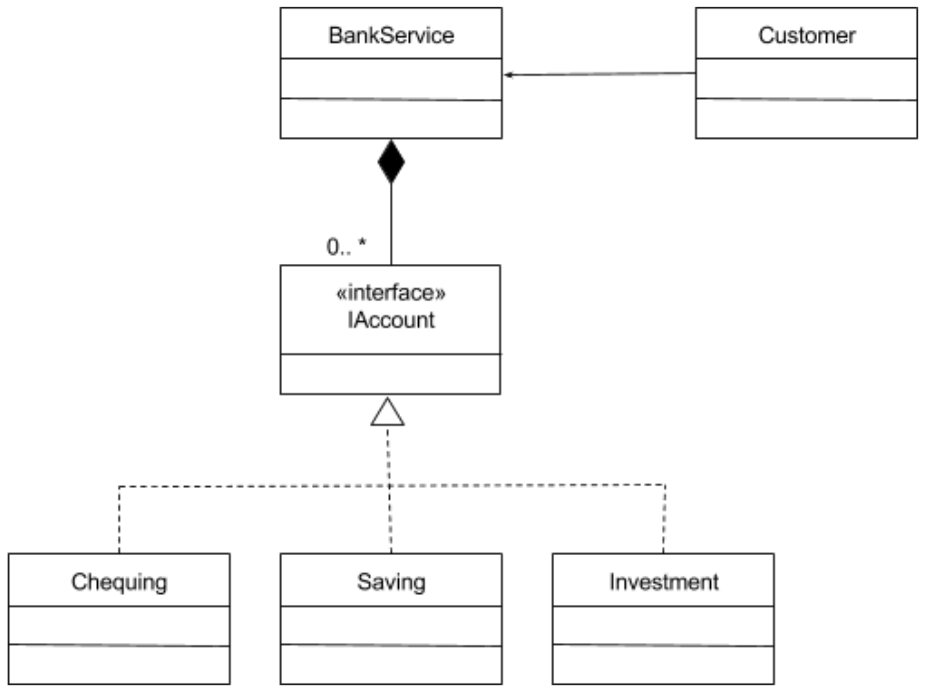

Key **design principles** are used to implement the facade design pattern:

* Encapsulation
* Information hiding
* Separation of concerns

## Adapter

This frequently happens when a pre-existing system needs to incorporate 
third-party libraries or needs to connect to other systems. 
The adapter design pattern facilitates communication
between two existing systems by providing a compatible interface. 
It is a structural design pattern.

The adapter essentially encapsulates the adaptee and
presents a new interface, or appearance, to the client class. 
It does this by wrapping the adaptee’s interface and exposing 
a new target interface that makes sense to the client.

**Steps:**

1. Design the target interface
2. Implement the target interface with the adapter class
3. Send the request from the client to the adapter using the target
interface

Adapter Concept Diagram

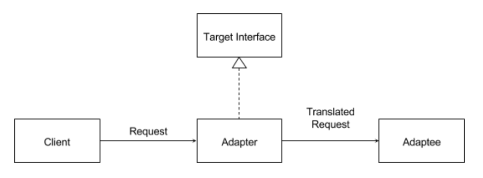

Adapter Example Diagram

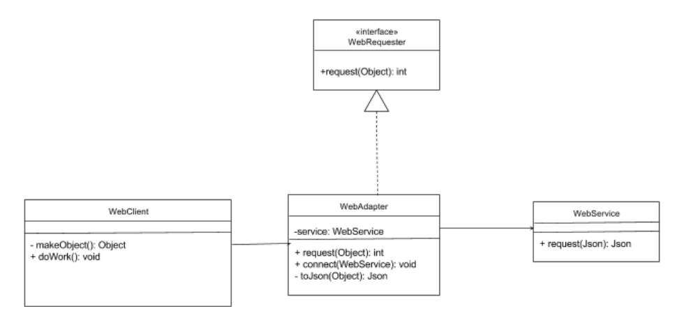

**What are the characteristics of the adapter design pattern?**

* The client and adaptee classes have incompatible interfaces.
* An adapter is a wrapper class that wraps the adaptee, hiding it from the client.
* The client sends requests indirectly to the adaptee by using the adapter’s target interface.
* The adapter translates the request sent by the client class into a request that the adaptee class is expecting.

An adapter is an effective solution. In summary, an adapter is meant to:

* Wrap the adaptee and exposes a target interface to the client.
* Indirectly change the adaptee’s interface into one that the client is
expecting by implementing a target interface.
* Indirectly translate the client’s request into one that the adaptee is
expecting.
* Reuse an existing adaptee with an incompatible interface.

## Composit

The composite design pattern is used to address two issues:

    How do we use individual types of objects to build a tree-like structure? and
    How can we treat the individual types of objects uniformly without checking their types?

How are these two issues addressed by the composite design pattern?
Each individual class is a subtype of an interface or superclass, and will be able to conform to a set of shared behaviors. (Absolutely! The leaf and composite class will share behaviour through the component class.)

The composite class is capable of aggregating component classes, which will create a tree-like structure. (Exactly! This structure allows composites to contain other composite classes.)

Expressing this in Java can be broken down into steps.

1. Design the interface that defines the overall type.
2. Implement the composite class.
3. Implement the leaf class

Concept Diagram

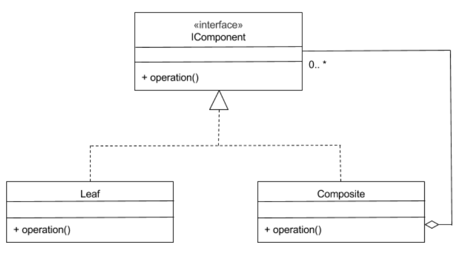

Example Diagram

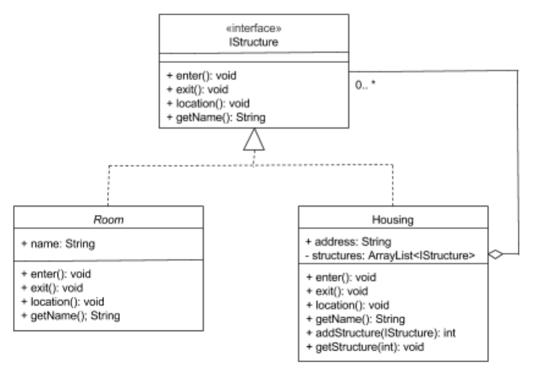

## Proxy

A proxy is something that acts as a simplified, or lightweight version, 
of the original object. A proxy object can perform the same tasks as 
an original object, but may delegate requests to the original 
object to achieve them.

The three most common scenarios where proxy classes are used are:

* To act as a **virtual proxy**. This is when a proxy class is used in place
of a real subject class that is resource intensive to instantiate. This
is commonly used on images in web pages or graphic editors, as a
high definition image may be extremely large to load.
* To act as a **protection proxy**. This is when a proxy class is used to
control access to the real subject class. For example, a system that
is used by both students and instructors might limit access based
on roles.
* To act as a **remote proxy**. This is when a proxy class is local, and
the real subject class exists remotely. Google docs make use of this,
where web browsers have all the objects it needs locally, which also
exist on a Google server somewhere else.

Implementation of this pattern in Java can be broken down into **steps**.

1. Design the subject interface
2. Implement the real subject class
3. Implement the proxy class

Proxy Concept Diagram

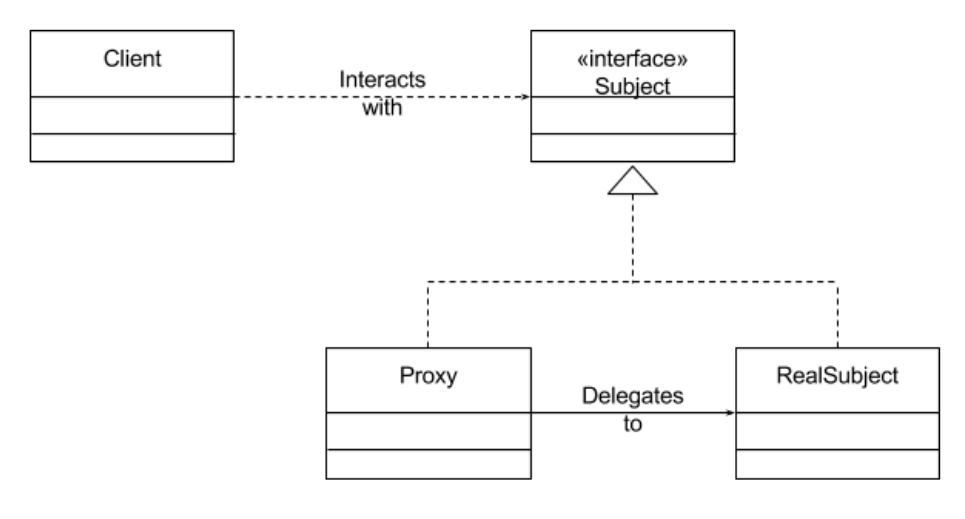

Proxy Example Diagram

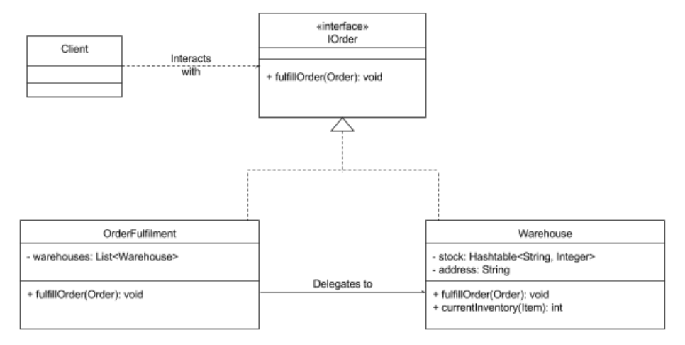

## Decorator

A decorator design pattern allows additional behaviours or responsibilities
to be dynamically attached to an object, through the use of aggregation to
combine behaviours at run time. It is a structural design pattern.

Implementation of this design pattern with Java can be broken down into
steps.

1. Design the component interface
2. Implement the interface with your base concrete component class
3. Implement the interface with your abstract decorator class
4. Inherit from the abstract decorator and implement the component 
interface with concrete decorator classes

Decorator Concept Diagram

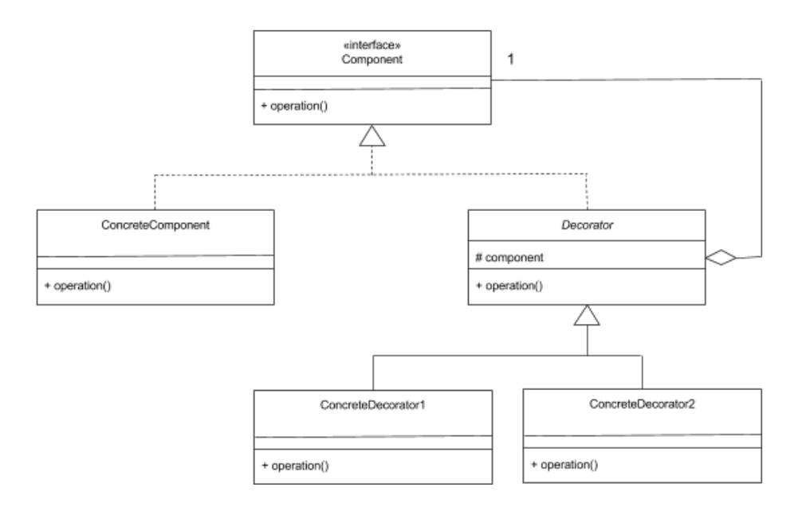

Decorator Example Diagram

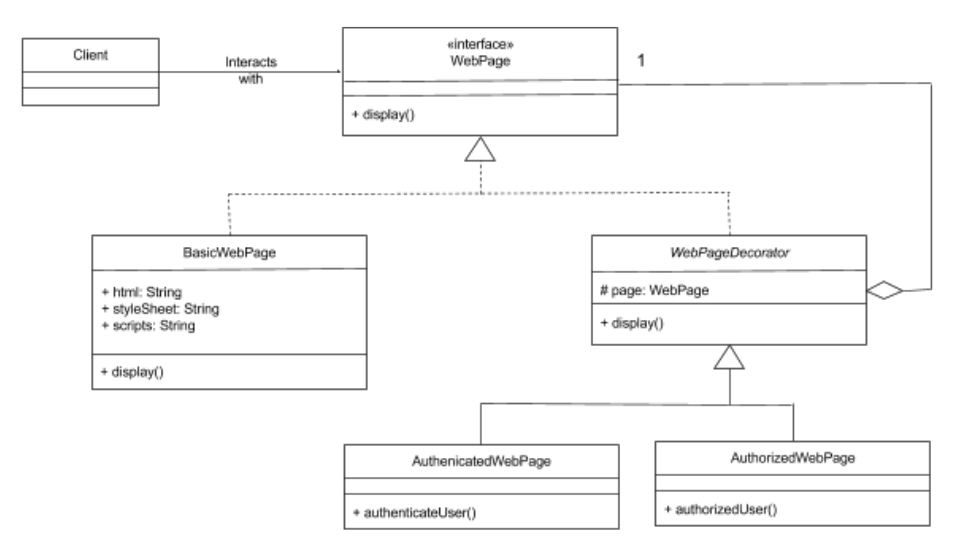

## Template  Method

The template method pattern defines an algorithm’s steps generally,
deferring the implementation of some steps to subclasses. In other words,
it is concerned with the assignment of responsibilities.

The template method is best used when you can generalize between two
classes into a new superclass. Think of it like another technique to use when
you notice you have two separate classes with very similar functionality and
order of operations.

 Template Method Example Diagram

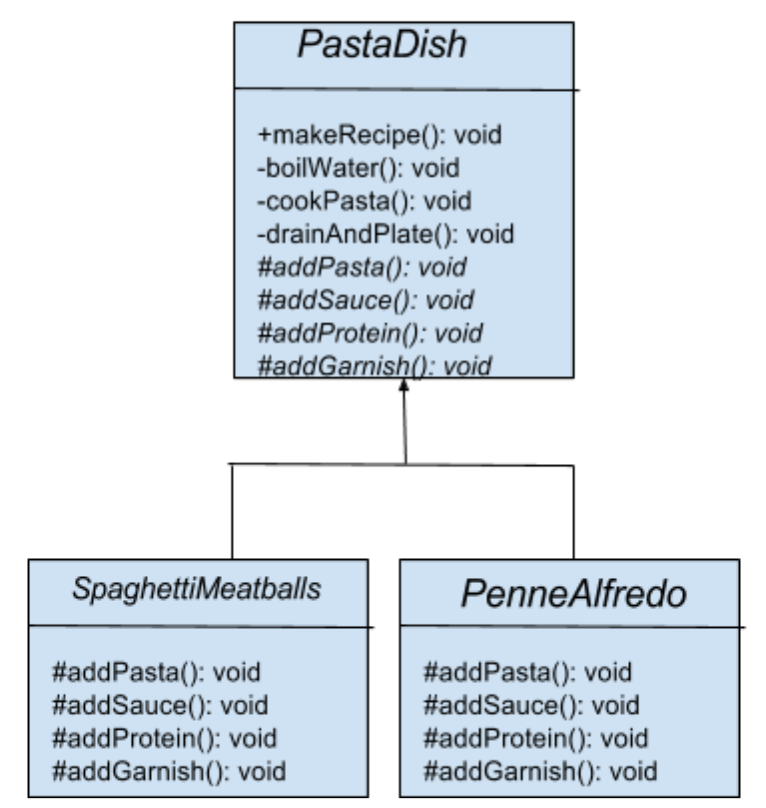

## Chain of Responsibility

The chain of responsibility design pattern is a chain of objects that are
responsible for handling requests. In software design, these objects are
handler objects that are linked together.

Each filter needs to go through the following steps:

1. Check if rule matches
2. If it matches, do something specific
3. If it doesn’t match, call the next filter in the list

Chain of Responsibility Concept Diagram

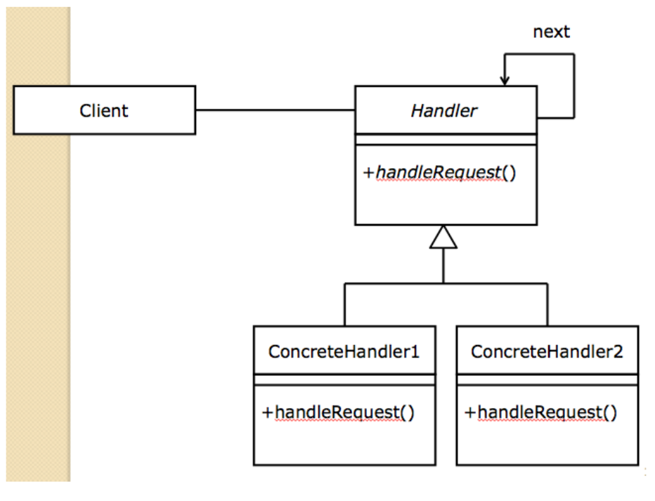

## State

Objects in your code are aware of their current state. They can choose an
appropriate behaviour based on their current state. When their current
state changes, this behaviour can be altered. This is the state design
pattern.

This pattern should be primarily used when you need to change the
behaviour of an object based upon changes to its internal state or the state
it is in at run-time. This pattern can also be used to simplify methods with
long conditionals that depend on the object’s state.

State Concept Diagram

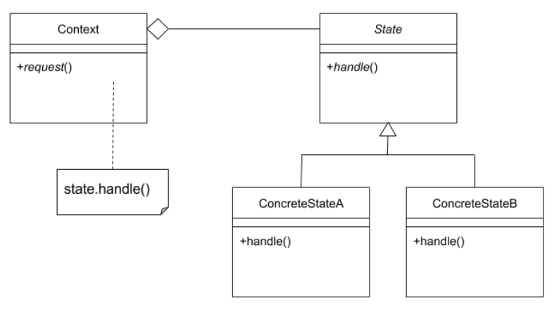

State Example Diagram

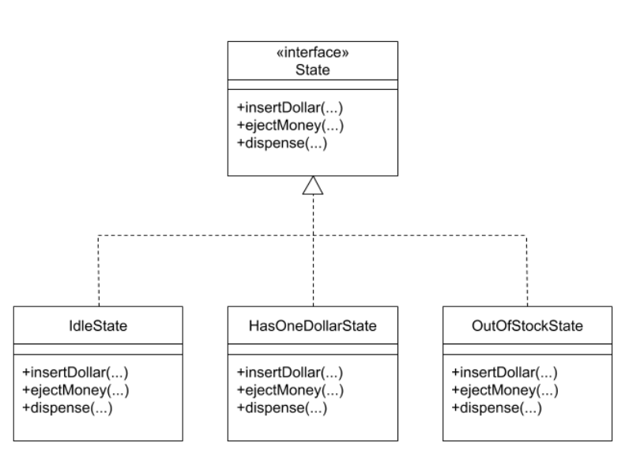

## Command

The command pattern encapsulates a request as an object of its own. In
general, when an object makes a request for a second object to do an
action, the first object would call a method of the second object and the
second object would complete the task.

Command Example Diagram

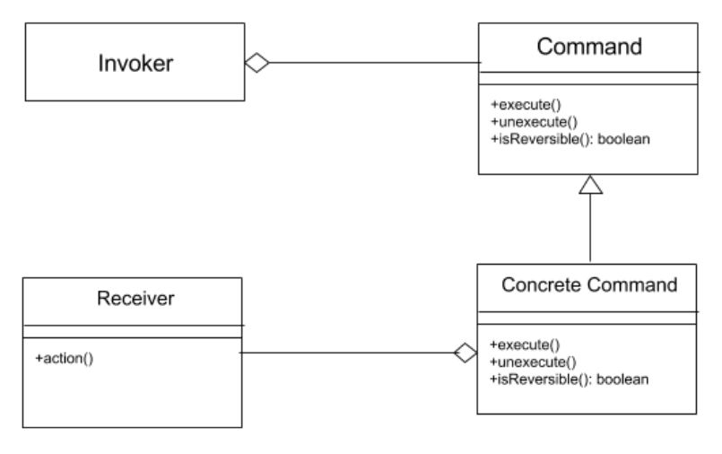

## Mediator

## Anti-Patterns & Code Smells

### Comments

1. If no comments are provided in the code, it can be hard to 
understand what the code is doing or should be doing.
2. If there are too many comments, they might get out of
sync as the code changes.
3. If the comments take on a "reminder" nature, so they indicate something that
needs to be done.
4. If a change is made to one section in the code, 
it needs to be updated in another method, this indicates bad code.
5. Comments might reveal that the programming language selected for the
software is not appropriate. This could happen if the programming
language does not support the design principles being applied.

### Duplicate Code

**Duplicated code** occurs when blocks of code exist in the design that are
similar, but have slight differences. This anti-pattern relates to the D.R.Y. 
principle, or “Don’t Repeat Yourself”.

### Long Method

The **long method** anti-pattern suggests that code should not have long
methods. Long methods can indicate that the method is more complex or
has more occurring within it than it should.

**DID YOU KNOW?**

    Some developers suggest that having an entire method visible at once on the
    screen is a good guideline, with no more than around 50 lines of code.
    However, some studies show that programmers can handle methods of a
    couple hundred lines before they introduce bugs! Determining
    "how long is too long"  for a method isn’t always a straightforward process!

### Large Class

The **large class** anti-pattern suggests that classes should not be too large.
This is similar to the long pattern above.

Classes should have an explicit purpose to keep the class cohesive, so it
does one thing well. If a functionality is not specific to the class’
responsibility, it may be better to place it elsewhere.

### Data Class

The **data class** anti-pattern is on the opposite end of the spectrum of the
large class. It occurs when there is too small of a class. These are referred to
as data classes.

### Data Clumps

**Data clumps** are groups of data appearing together in the instance
variables of a class, or parameters to methods.

### Long Parameter List

Another code smell is having **long parameter lists**. A method with a long
parameter list can be difficult to use. They increase the chance of
something going wrong.

The best solution for long parameter lists is to introduce parameter objects.
A parameter object captures context.

### Divergent Class

Some code smells occur when making changes to the code itself. A
**divergent change** is one such code smell. It occurs when you have 
**to change a class in many different ways, for many different reasons**. 
This relates to the large class code smell, where a large class has many 
different responsibilities.

If a class is being changed in multiple ways, then this is a good indicator 
that the responsibilities of the class should be broken up into separate classes, 
and responsibilities should be extracted into their own classes.

Separation of concerns resolves two code smells – large class and divergent
change.

### Shotgun Surgery

**Shotgun surgery** is a code smell that occurs when a change needs to be
made to one requirement, and a numerous classes all over the design need
to be touched to make that one change.

### Feature Envy

Feature envy is a code smell that occurs when there is a method that is
more interested in the details of a class other than the one it is in. If two
methods or classes are always talking to one another and seem as if they
should be together, then chances are this is true.

### Inappropriate Intimacy

**Inappropriate intimacy** is a code smell that occurs when two classes
depend too much on one another through two-way communication.

If two classes are closely coupled, so a method in one class calls methods of
the other, and vice versa, then it is likely necessary to remove this cycle.

Cycles are not always necessarily a bad thing. Sometimes, they are
necessary.

### Message Chains

**Message chains** is a code smell that occurs when the code has long
message chains where you are calling, and get an object back, and then
calling again, and getting another object.

### Primitive Obsession

Primitive obsession is a code smell that occurs when you rely on the use of
built-in types too much.

### Switch Statements

Switch statements are a code smells that occur when switch statements
are scattered throughout a program. If a switch is changed, then the others
must be found and updated as well.

### Speculative Generality

The code smell speculative generality occurs when you make a superclass,
interface, or code that is not needed at the time, but that may be useful
someday. This practice introduces generality that may not actually help the
code, but “over-engineers” it.

In Agile development, it best to practice Just in Time Design. This means
that there should be just enough design to take the requirements for a
particular iteration to a working system.

### Refused Request

A refused request code smell occurs when a subclass inherits something
but does not need it. If a superclass declares a common behaviour across
subclasses, and subclasses are inheriting things they do not need or use,
then they may not be appropriate subclasses for the superclass.
Or perhaps the unwanted behaviours should not be defined in the superclass. 
Finally, if only some subclasses use them, then it may be better 
to define those behaviours in the subclasses only.