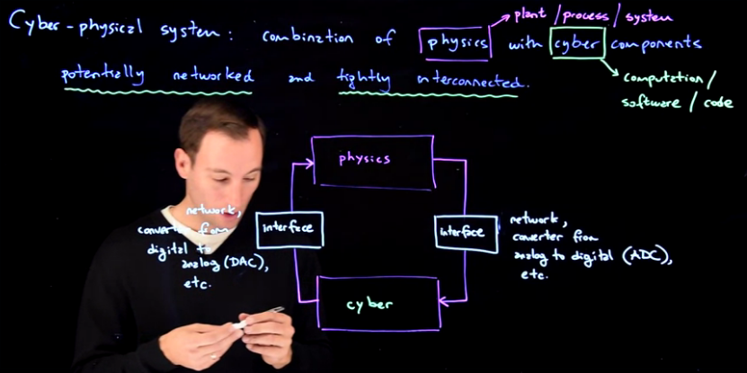
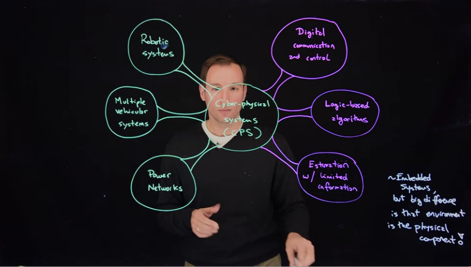

# Cyber-Pysical System

## Introdution

Cyber-Pysical System (CPS) is a system that combines, physics with cyber component **potentially networked** and **tightly interconnected**.

* **Physics**: the tangible part of the system, the plant, the process, the system
* **Cyber**: Computation components, the software , the code

The CPS, can be to involve a specific class of applications, basic tools, or methods*. That actually makes CPS a very interesting and relevant field of study.

* Class of applications Physics
    * Robotic Systems
    * Mutiple Vehicle System
    * Power Networks
* Analyze or synthesize controllers on interfaces for a CPS
    * Digital communication and control
    * Logic-based algorithms
    * Estimate with limited information

## Overview

The cyber-physical systems are similar to embedded systems, but the big difference is the enviroment

Cyber-physical systems are similar to embedded systems,
but the big difference is that the environment which is what is part of an embedded system, in CPSs, are the physics. And those physics play a key role,and they actually changed the way we need to design the cyber part. So as I said in the previous slide, typically, we cannot design the physics and the cyber separately as done in embedded systems.

    "We actually really want to make sure that the environment is handle the right way."

## Modeling Cyber-Physical Systems

* Discrete-time model
    * The tie is discrete, k \in {0,1,2,3,, ...}, set of N
* Finite-state machines
* Continuous-time models
    * The time is continuos, t \in [0, +inf), set of R >= 0
* Impulsive continuois-time models
* Event-triggered continuos-time model
* Hybrid automata
* ...

Those type of models can be further 
extended if we now allow the variables of a continuous-time model to have jumps,
and those are impulsive continuous-time models.
Those jumps could be time-triggered or could be event-based-on-a-state-triggered.
So event-triggered continuous-time models is another class.
And combining essentially all of these type of modes,
one can reach to a more general type of modeling framework called hybrid automata.
Hybrid automata, in simple words,
combines elements of finite-state machines and
elements of continuous-time models with the impulses. 

The model of a cyber-physical system, the entire system will involve 
**discrete-time to keep track of the cyber steps** 
or the **computations and continuous-time to keep track of the physics evolution**, 
and it will essentially combine the two of them into a notion 
of time which we will call hybrid time.

True or false: A cyber-physical system has trajectories that change continuously, 
and at isolated time instances, exhibit jumps.

A.: |**True**

Select all of the true statements about the discrete-time model

The state \etaη of the system collects all of the variables that are needed to describe its evolution over discrete time

P