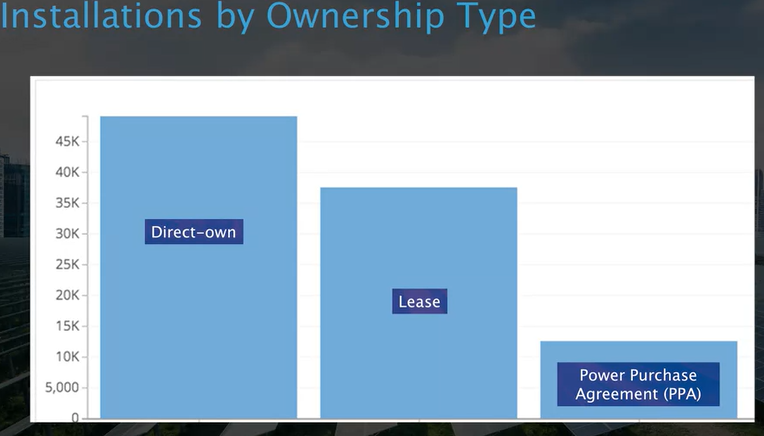
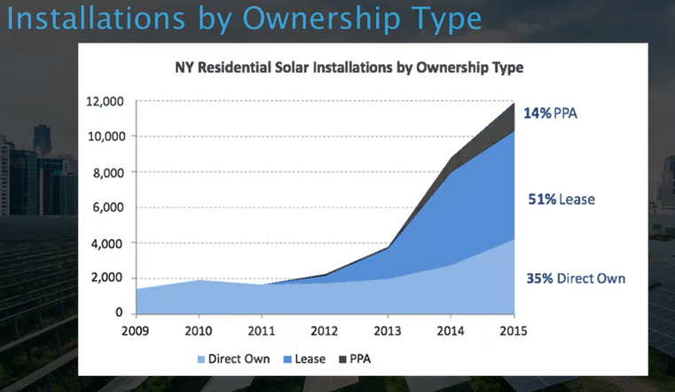

[NREL National Solar Radiation Database](https://nsrdb.nrel.gov/)

Description: Interactive database and supporting information reporting meteorological data and the values of three most common measurements of solar radiation, including global horizontal, direct normal, and diffuse horizontal irradiance.

[Wind energy maps and data](https://windexchange.energy.gov/maps-data)

[Differences between wind power and solar energy](https://www.directenergy.com/learning-center/differences-between-wind-solar-energy)

[How Solar Cells Work](https://www.acs.org/content/acs/en/education/resources/highschool/chemmatters/past-issues/archive-2013-2014/how-a-solar-cell-works.html)

1. Where were Solar cells first produced?
The first solar cell was created at Bell Labs in New Jersey

2. Which country has the most PV on a per-capita basis?
Germany has the most solar PV on a per-capita basis.

3. Cloudy days still produce significant PV Energy ?
True. Correct! Solar energy is still falling to earth on cloudy days. 

4. Discarded PV modules are hazardous to the environment.
Correct! PV modules do not contain hazardous chemicals.

The "Net Metering" incentive "banks" your excess energy with the utility.
Correct! Energy producers receive a credit for energy that is sent back to the grid.

What country has installed the most PV? 

Although Germany leads in PV per capita, China has the most installed PV. 

Batteries:

* can supply a steady source of electricity.
* reduce use of Natural Gas Peaking plants.
* can "shave" electrical demand peaks.

PV Modules use **aluminum, silicon and copper**.

The net metering incentive is valued at the standard per kWh rate. (T/F)

True

Energy producers earn credits at their standard rate, and these can be used at times when there is little or no sun. 

Between 2015 and 2020, what was the largest United States PV market segment ? 

**Utility** scale applications made up the vast majority of PV installations in the United States between 2015 and 2020.

About how much solar energy does the earth’s land surface receive annually? 

200,000 Trillion KWh

Keep in mind that this figure is for the earth’s land surface only and does not include all of the energy falling on our oceans. 

Question 8

Wind Power is very site specific. (T/F)

True

Solar PV offers more flexibility than wind turbines in terms of location.  

Question 9

Select the response that presents the solar history events in the correct order.

1. B: Solar cell developed by Bell Labs
2. A: Solar cells used widely on spacecraft
3. D: China entered solar market
4. C: Price of solar cells decreased due to mass production

Select all solar energy incentives from the list below. 

* Net metering
* Cash rebates
* Accelerated depreciation
* Tax credits

https://solarpoweredblog.com/on-grid-vs-off-grid-solar-systems/

https://solarpoweredblog.com/on-grid-vs-off-grid-solar-systems/

https://www.solarpowerauthority.com/grid-tied-off-grid-hybrid-solar-system-right/

1. When added to crystalline silicon which element gives a negative charge?

Correct! Phosphorus creates a negative charge when added to crystalline silicon.

2. A String Inverter has one or more high DC voltage inputs and outputs 208 or 240 VAC.

Correct! A string inverter outputs 208 or 240 VAC.

3. hen bolting mounting racks to a roof, they must be attached to the roof rafters or trusses.

Correct! Mounting racks must be secured to the roof, which is typically accomplished by bolting to the roof rafters or trusses.

4. Ground mounting provides more options than roof mounting.

Correct! There are far more configuration options available for ground mount solar PV systems, as opposed to roof mounting.

5. A ballasted mounting system prevents roof penetration on a flat roof.

Correct! Ballasted systems are held in place using weight instead of roof penetrations.

 For a while there was a lot of increase in leasing of solar panels, and now today in the last 20 years, more people are just owning them. There are still leases and there are power purchase agreements. Leasing is where you have an array on your roof but you don't own it, you're actually paying some leasing company and they have to do the maintenance on it. But a lease is usually a fixed cost per month. A power purchase agreement or PPA is where you pay per kilowatt hour.

### Installations by Ownership

* **Direct-own**: more people are just owning them
* **Lease**: Leasing is where you have an array on your roof but you don't own it, you're actually paying some leasing company and they have to do the maintenance on it.
* **Poewer Purchase Agreement (PPA)**: is where you pay per kilowatt hour.

### Benefits of Solar PV Ownership

* Outright purchase and ownership attributes all the financial
benefits and risks to the owner
* Maximize financial benefits if grants and Investment Tax Credit (ITC) can be used.
* Renewable energy credits can be sold
* Businesses can  depreciate the solar system asset

### Benefits of Purchase Power Agrreements (PPA) and Leasing

* PPAs and Leasing
    * Bothg assign the risk and a major portion of the financial benefits to third party
    * Usually no money down
* PPA
    * Pay per Kilowatt-hour
    * Increasing in popularity  with community solar projects

### Rasons for Solar Adoption

* Homeowners want to go solar because they:
    * feel beholden to the utility company (lack of control)
    * want to be green
    * want the last gadget
    * see that neighbors have it
    * want electricity when the utility power is out
    * want to save money
*  Business owners want to save maney by controlling energy costs

### Installation Costs

* Hardware
* Labor
* Overhead
* New equipament (i.e fuse box upgrade)
* Post Installation
* Locally licensed electrician
* Large equipament (i.e materials lift or excavator)

### Incentives

* Grants
* Tax credits
* Accelerated depreciation
* Tax exemption
    * Per municipality

### Calcualating System Cost to End User

*Install cost* without grant, federeal tax credit, state tax credits, and depreciation (comercial only)
**plus** *estimated manitence costs* (est $100/yr residential)
**is equals** to *System Cost to End User*

**For silicon the production goes down about 0.5 % per year.**

### Calculating KWh Production

(*System cost to end user*) **by** (*25-year-production*) **is equals** *Cost per KWh*

