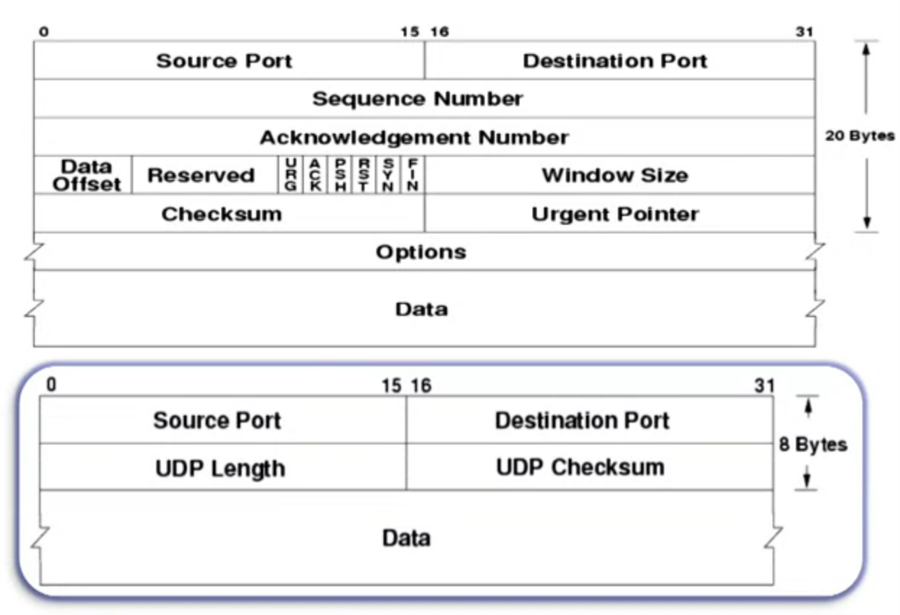
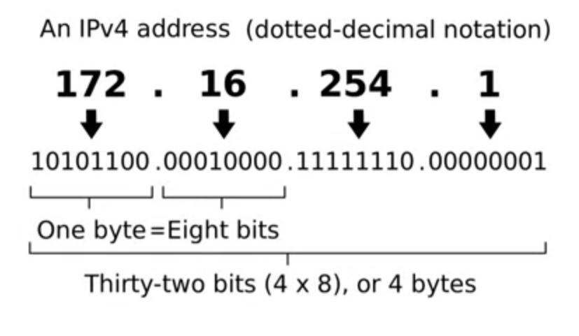
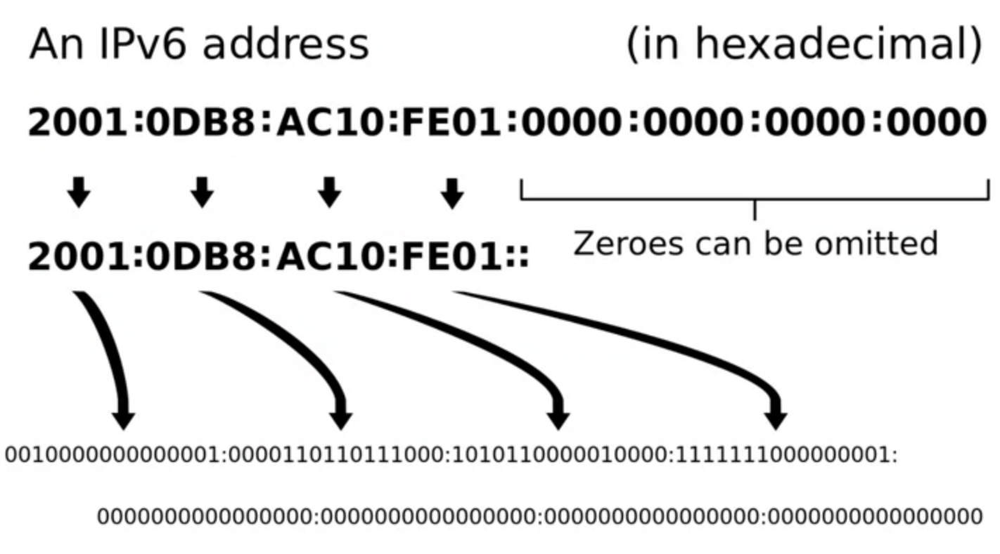
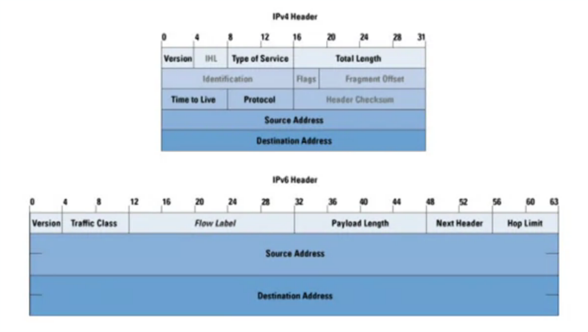
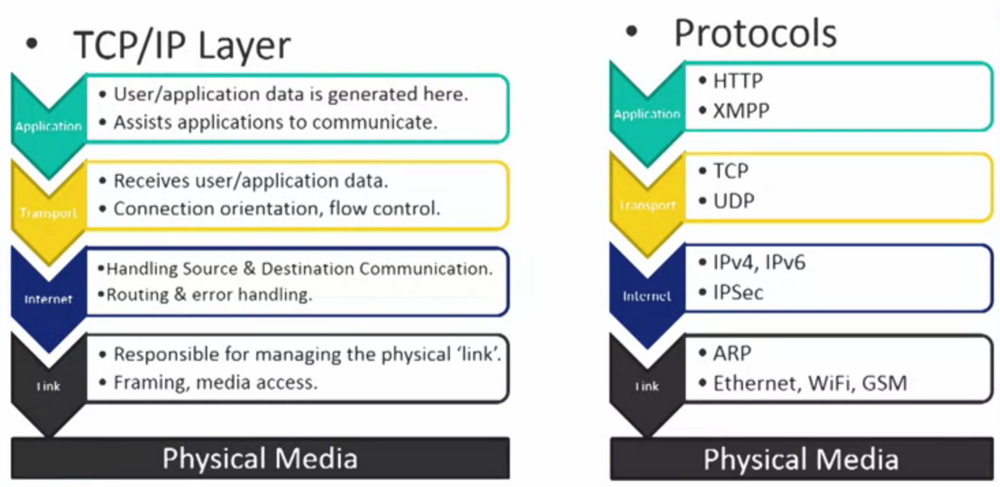

# Web Connectivity and Security in Embedded Systems

Why Connect Embbed Systems?

* Standalone Embedded Systems
* COmplex Devices

Web Connectivity

* Ubiquitous
* Scalable
* Mature and Tested Technologies
* Cross-platform
* The Future is Web-based:
    * Cloud Computing
    * Big Data
    * Remote Intelligence

Web Connectivity: The Ugly

* Increase in Complexity
* Security
* Resource Heavy
    * Processing Power
    * Memory Consuption
    * Cryptographic Computation Costs

What is WWWW?

* The internet Enables WWW
* WWW FAcilitates interaction
* Web is the traffic

Internet Protocol

* TCP/IP model, the list below show the layers in order:

    * **Application**
        * Top most layer, user/application data is generated here.
        * Provides protocols for applications to communicate.
        * Examples: HTTP, XMPP
    * **Transport**
        * Receives user/application data from application layer.
        * Provides: Connection orientation, reliability, flow control.
        * Examples: TCP, UDP
    * **Internet**
        * Handling Source & Destination Communication
        * Routing
        * Examples: IP, IPSec
    * **Link**
        * Responsable for managing the physical "link".
        * Framing, end-point communication, media access.
        * Examples: Ethernet, ARP

What is the main benefit of streaming media via HTTP?

* HTTP can easily scale up according to the user's need. **Correct**
* It is affordable solution as the infrastructure is available. **Correct**
* HTTP is secure. **Fasle**
* The traffic goes through a port that is even blocked.**False**

User Datagram Protocol

* What is UDP?
    * No handshake
    * Features
        * Conectionless
        * Stateless
        * Lightweight
    * A UDP header has 8 bytes and TCP header has 20 bytes

UDP Cases

* Real-Time streaming
* Time sensitive application
* Bandwidth limitations
* Broadcasting
* Protocols:
    * DNS, DHCP, NTP
    * TLS, DTLS

Internet Protocol

* Addresing
    * IPv4
        * 32 bit adress space
        * About 4.9 billion addresses
    * IPv6
* Routiung
    * RIP
    * OSPF - Open Shortest Path First
    * BGP - Border Gateway Protocol
* Erro Control
    * ICMP
* IPSec

A jump from one router to another is called a hop.
In theory you can reach anywhere i the internet with a maximum 64 hops, and reach motre than 99% of the internet using 32 hops.

Some protocols have limitations. For example, the  RIP has a limit of 15 hops.

* IPv4
    * 32 bit adress space
    * About 4.9 billion addresses

* IPv6
    * Same attributes as IPv4.
    * 128 bit address space
    * Twice the header size as IPv4
    * Intended to replace IPv4
    * One problem with IPv4 is that there are more device
    connected to the internet then there are available at vertices that you can assign.
    * about 2^128

IPv4 vs IPv6

IPv6 has a 128-bit address space whereas IPv4 has a 32-bit address scheme 

"Did you find any problems in Module 1, or were some things unclear? Post it here and maybe some smart person has an answer to your problem!"

Link Layer

* Local Operation
* Functions:
    * Local Addressing
    * Error Checking
    * Framing
    * Media Access Control

* Exmpls ARP, Ethernetm WIFI

Overview

