## M2M Connectivity Protocols

In CPS the connectivity solutions can broadly be divided into two main categories: 

* Wired
    Require a physical conncetions between endponints
* Wireless.
    Don't have any physical medium

Wired connections generally tend to have higher date
rates and higher power consumption but this is not always the case.

Parameters that help us defining and
distinguishing connectivity protocols.

* Range
* Data Rate
* Power Consumption
* Topology
* TCP/IP Support
* Spctrum
* Estimated Node Support
* Approximate  Cost

**Range**

Define the distance the protocol can offer connectivity.

* PAN - Personal Area Network
    * Interconnects devices within the personal space of an individual.
    * 10cm - 10m
* LAN - Local Area Network
    * Interconnects devices within a limited area auch as a home, office or building.
    * 10m - 500m
* MAN - Metropolitan area network
    * Interconnects devices within a city o district
    * 500 - 50Km
* WAN - Wide Area Network
    * Generally has no geographical restrictions, location or size.
    * Can be restricted to a specific country for example

**Data Rate**

Defines how much data per second you can transfer

* Low < 1 Mbps
* High > 1-2 Mbps
* Very High > 50 Mbps+

2 Mbps of sustained throughput is pretty high for
most embedded systems, because your smart energy meter or
smart lighting system, like Philips Hue, doesn't watch Netflix.

Data transfers are typically periodic updates which do not require high data rates. 

**Power Consumption**

Power consumptions gives you an idea about battery life and
a data throughput of your interconnection protocol.

* Idle
    * The power used when the devices is in the state of rest.
    Meaning, no comunation is takin place.
* Active
    * The device is in full communication mode.
* Power Profiles
    * The protoco offer different power profiles:
        * Idle state enabling profile
        * Low data rate profile
        * Receive only profile
        * Transmit only profile
    * Each save power

Generally, the lower the power consumption, the lower the data 
rate. Higher rates mean the device is on for longer periods of 
time and has to process more and faster, thereby increasing 
power consumption. 

**Topology**

**TCP/IP Support**

An important question is,
does the connectivity protocol support TCP/IP on the higher layers? This is essential in two main ways:

1.  supporting TCP/IP means easy aggressing and
connectivity to existing internet or legacy systems that are already deployed.
2. it makes web connectivity very easy.

* Simplifiews Web-Connectivity
* Gateways
    * Cons: Complexity and additional cost.
    * Pros: Extensibility and extended functions.

**Spectrum**

* Free: ISM - Industry Scientific and Medical
    * WiFi
    * Bluetooth
* Comercial
    * Requiring to get a license to operate
    * GSM

**Estimated Node Support**

* How many clients can a typical Gateway Support?

**Approximate Cost**

* 1 vs 100,000
* Even pennies become too much 

## Connectivity Protocols

**Ethernet 802.3**

* Consume a lot power
* It's cheep enough

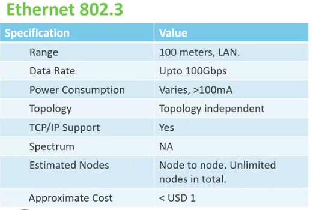

**Wi-Fi 802.11**

Power consumption varies based on the module and
manufacturer, but it's not a power friendly standard.
The number of devices connected to a single gateway depends on the available
bandwidth, which will be divided between the connected clients and
the processing power and memory of the system. 

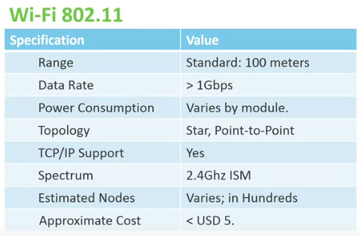

**Bluetooth**

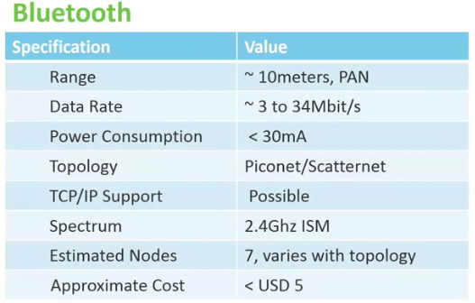

**Bluerooth Low Energy**

* It's designed for sending periodic chunks of data
* The data rate of just 1 Mbps
* Mesh it is not supported

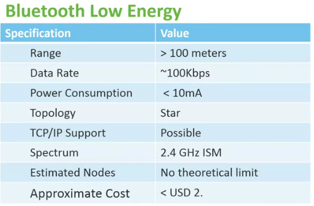

**ZigBee**

* Is a standard for low power mesh network nodes.
* Due to the mesh nature, it can offer connectivity over longer
distances.
* The physical or link layer use the 802.15.4 standard
* It also defines the network and application layer protocol
* ZigBee is also a communication protocol

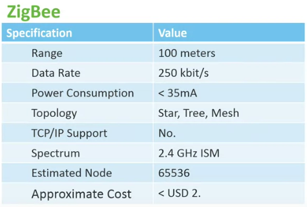

**RFID**

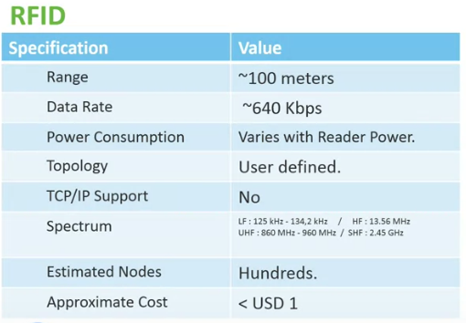

**GSM**

* GSM has multiple standards: 1G, 2G, 3G (generation).
* The data rates and number of users per cell improves 
eith each generation.
* The current dployed is:
    * 4G, have commpitors standards:
        * WiMAX
        * LTE
    * 5G (in dev)

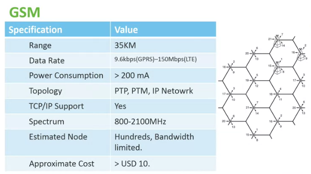

**6LoWPAN**

6LoWPAN stands for IPv6 over low power wireless personal area networks.
As the name suggests, it is a standard that enables the use
of IPv6 on low power edge devices.
By natively communicating using Internet Protocol, 6LoWPAN devices and
networks don't require any special gateways to connect to other IP networks,
such as the Internet.
Therefore, 6LoWPAN offers interoperability and
simplicity in design compared to ZigBee or Bluetooth.
Essentially, this standard enables IPv6 packets to
be transmitted over IEEE 802.15.4,
which is a standard for low data rate wireless personal area networks.
This makes 6LoWPAN ideal for cyber physical systems,
where IP connectivity and low power consumption are essential. 

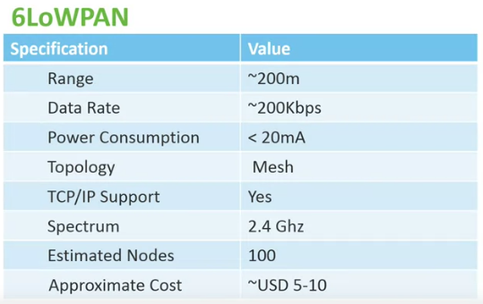

## M2M Communication Protocols

M2M connectivity protocols facilitated linking of the devices and
reside on the link layer, while M2M communication protocols facilitate
messaging between devices and reside on the application layer. 

Interoperability between devices:

* Standardized naming
    * means defining how each device will be referred, recognized, or found.
* Standard messaging
    * Determines how each message is formatted, so that all the devices can understand it
* Standard controls 
    * Enable the devices to control the flow of communication or quality of service, or to define the type of a message. 

The basic features of M2M communication protocols:

* Communication Pattern, refers to communication model or paradigm the protocol follows. Examples:
    * Request-response model
    * Publish-subscribe model
* Transport Protocol
    * TCP
    * UDP
* Reliability
    * Does the protocol offer any assurance of delivery.
    * Does it have mechanisms to ensure the transmission of messages in uncertain circumstances or during unreliable connections?
    * What mechanisms would the protocol would rely on to achieve this? 
* Security
* Distributed Operation/Centralized
    * communication is one to one
* Service/Node discoovery
* Messages and Payload Support

**Constrained Application Protocol - CoAP**

* Similar to HTTP but not interchangeable
* Designed to be lightweight
* Publish-Subscribe Mode
* Transport Protocol: UDP

This enables efficient congestion control and reliability over
UDP Here you see a short overview of the protocol. 

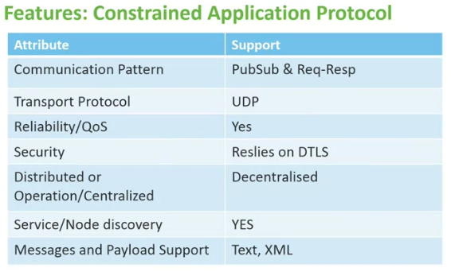

**Hyper Transport Protocol - HTTP**

* Ubiquous
* Backbone of the Web
* Slow, Old, Heavy
* URI & Resource Discovery
* REST (Representational State Transfer) Style of Design

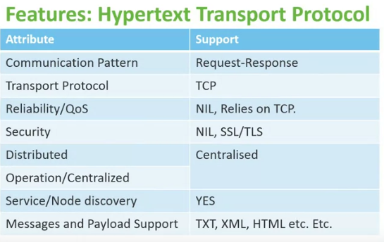

**Message Queue Telemetry Transport - MQTT**

* Designd by IBM for Telemetry
* Lightweight
* Can be used over SMS and LLNs

Besides this, the protocol can transmit data over low bandwidth and
reliable connection. 

MQTT is inherently a published subscribe protocol.
Clients connect to a server to send and
receive messages on the channels of their interest.
The server is called a broker, senders are publishers, and receivers are subscribers.

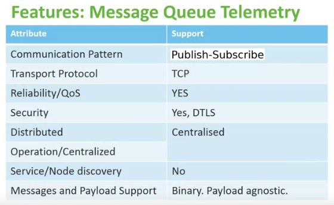

**Extensible Messaging and Presence Protocol - XMPP**

* Relies on XML
* Slow but secure
* Real-time in terns of humans not machines

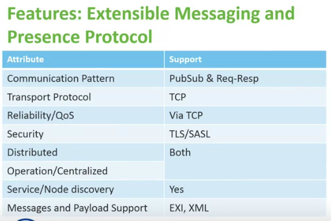

**Data Distribution Service DDS**

* Used by Military
* Bus like architecture
* Near real-time communication
* Hides a lot of device / communication complexity
* Can be utilized as middleware between processes and not juts devices.
* Hard real-time applications

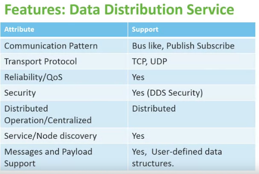

**Advanced Message Queuing Protocol - AMQP**

* Used by Financial Industry
* Message Oriented (unit of work)
* Focuses on efficiency processing queues
* Reliable (Store-and-Forward)
* Server side callbacks (contray to HTTP)
* Relatively Slow

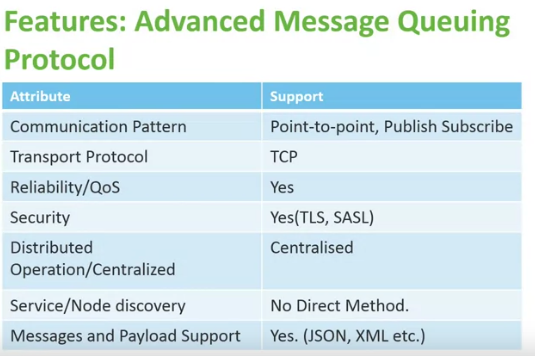