# Web Connectivity and Security in Embedded Systems

## Embeddable Webservers

### Webservers

* They respond to user requests.
* They serve informations and files.
* They understand HHTP
* They understand URLs

    http://192.168.1.1/local/index.html

### Embeddable Webservers

* What are they?
    * Web servers that are small enough that you can
    execute them as part of your standard application code.
* SMEWS
    * Very ligth weight
    * Designed for Web of Things
* Mongoose
    * Small compared to other server options
    * Designed to be Embedded inside C Applications.

SMEWS - Smart and Mobile Embedded Web Server

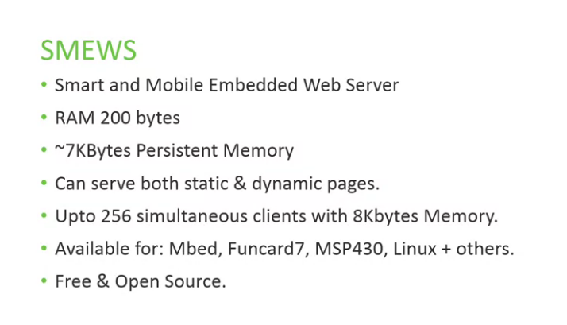

Mongoose

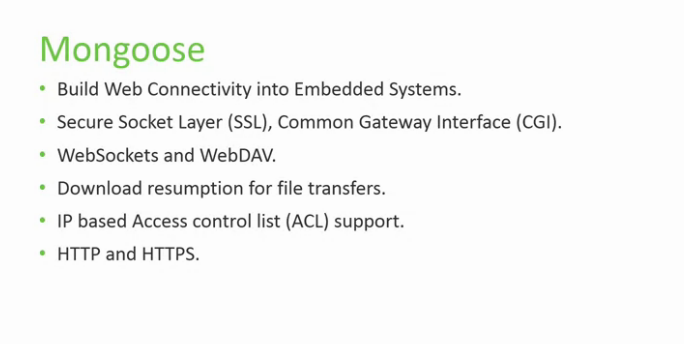

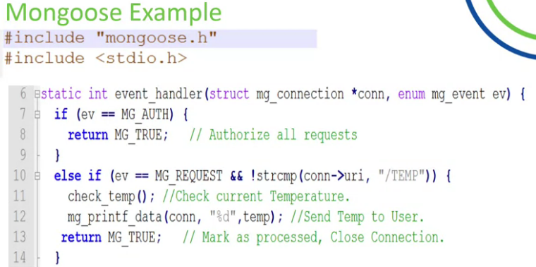

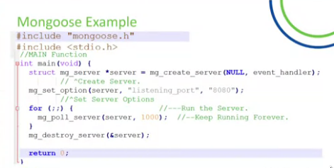

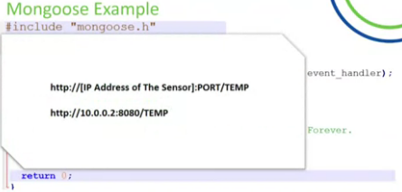

## Web Services

### REST

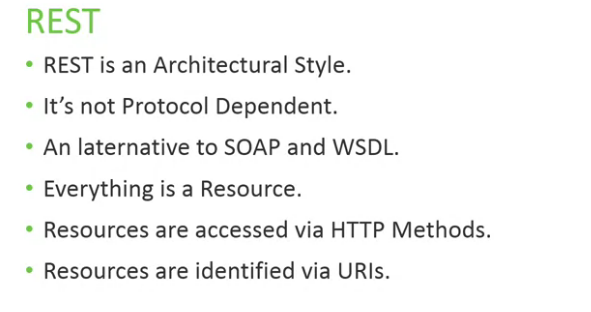

### SOAP

* Sample Object Access Protocol
* XML formatted objects
* HTTP, HTTPS, SMTP, or AMQP
* Platform Independendt
* Characteristics
    * Extensibillity
    * Neutrallity
    * Independence

### REST vs SOAP

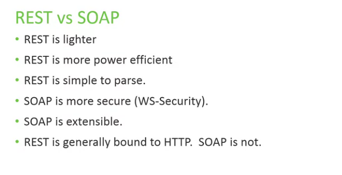

## How to Rest

### Understanding REST

* REST is an Architectural Style
* REST Constraints:
    * Separation of Client-Server
    * Stateless
    * Cacheable
    * Uniform Interface
    * Layered Desing

This restriction reduces complexity and makes it easy to add and remove layers.

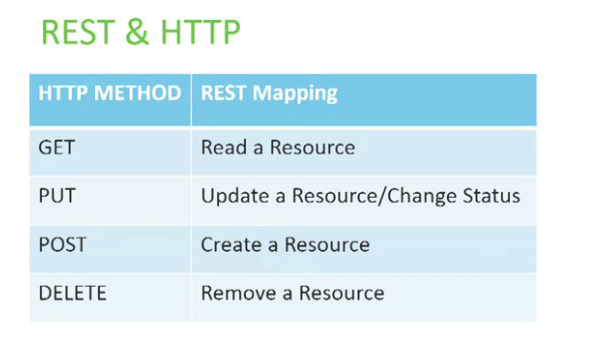

### REST & CPS

* Resourses
* CRUD operations
* REST is Lightweight
* REST is more Power Efficient
* REST is momory efficient

### Best Practices

* What will be your resources?
* URIs that repressent these resources?
    * Simple, focused
* Action verbs against URIs?
    * GET or POST or both?

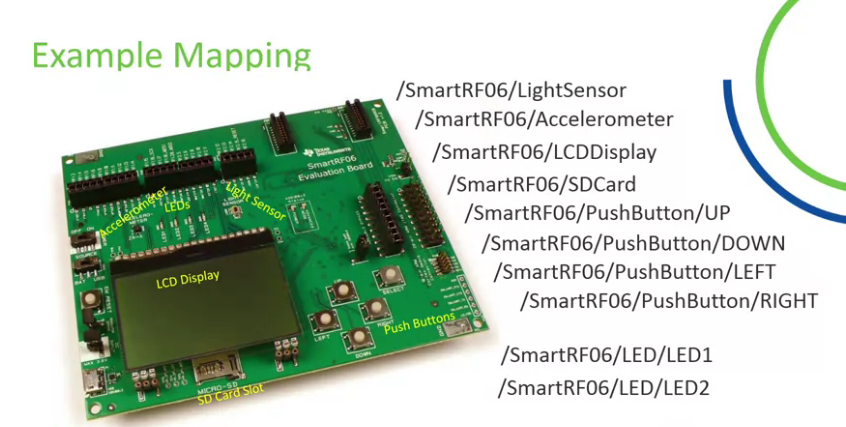

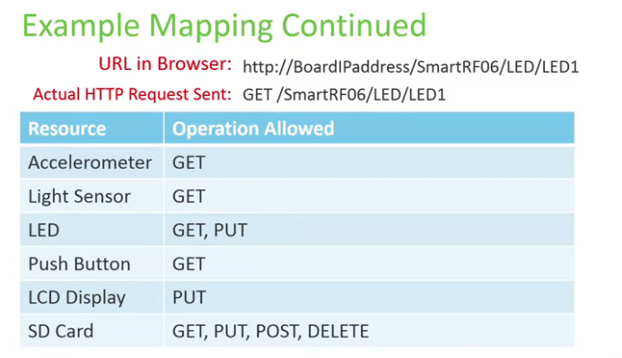

## Cloud on CPS

### Cloud Computing

* what is Cloud Computing?
    * Is about utilizing computational power as a utility like electricity or gas.

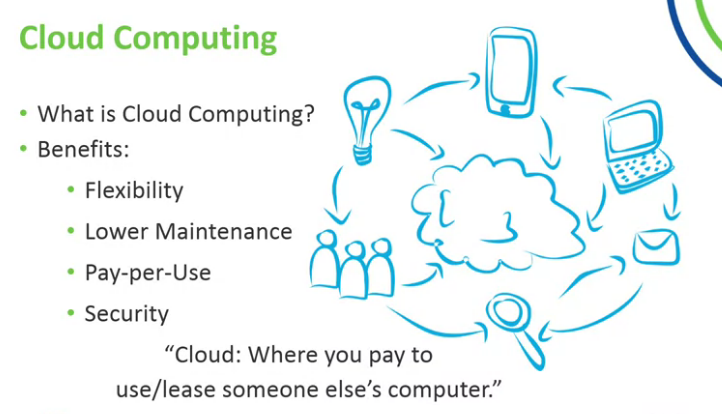

###

When you take a small embedded device and assign it an IP address,
you can uniquely identify it, remotely access and
control it and share its data across the internet.

What you have done is that you have built an Internet of Things device
or IoT device. You had a device, a thing, and you made it a part of the internet. 

**IoT vs CPS**

* IoT is about monitoring or sensing the real world with interconnected sensors.
* Cyber physical systems are the same. 

### Cloud IoT

* Cloud Infrastructure designed for IoT
* Considerations for Cloud Backends
    * Communication Hardware & Software Support
    * Protocol Support (RESTFul HTTP, MQTT, XMPP, etc)
    * Node Management (e.g remote device control, firmware updates)
    * Data Analytics
    * Pricing Model

Cloud IoT Platforms

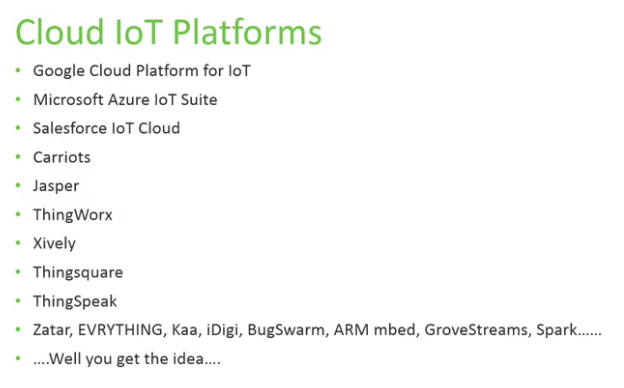

## Fog Computing

**What is it?**

Fog computing suggests that some processing takes place
at the end devices or gateways.
It's called Edge Intelligence because
the computation takes place at the edge of the network where the data
is initially generated instead of the core where it is later transferred. 

**Why Fog?**

* Big Data Relocation
* Moore-Nielsen Paradigm
* Moore's Law
* Local Filtring

### Characteristics & Benefits

* Latency & Location awareness
* Heterogenity
* Edge Intelligence/Analytics
* Small Data
* Local Availability
* Security & Compliance

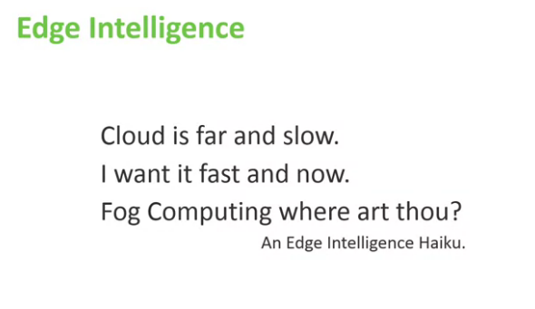
