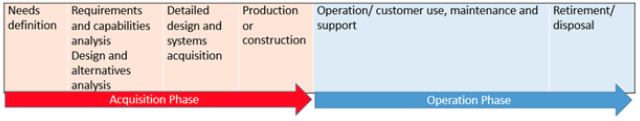

# Module 1

At the end of Module 1, you will be able to: 

1. Define and differentiate among drones, UAS, UAV, and other industry-specific 
terminology. 
2. Summarize the history and background of unmanned aerial systems.
3. Describe the  general applications of drones, including common usages, 
capabilities, and sectors and markets. 
4. 5Summarize critical research areas as they relate to current and future 
growth of emerging drone technologies.

Terms:

* **Drone** is an inexact term which can refer to any unmanned 
vehicle.The robots and remote-controlled vehicles are occasionally 
referred to as drones.
* **Unmanned Aerial Vehicle (UAV)** is an aircraft remotely operated by a pilot 
located at a ground control station.
* **An Unmanned Aerial System (UAS)** is the unmanned aircraft and the 
associated support equipment, control station, data links, telemetry, 
communications, and navigation equipment that is necessary to operate the 
unmanned aircraft.
* **Small Unmanned Aerial Systems (sUAS)**, the FAA defines the small UAS as an unmanned aircraft weighing less than 55 pounds.

Critical drone technologies include:

    Navigation
    Sensors
    Communications
    Artificial Intelligence 

 KC1.1 Question 1

Compare UAS and UAV. Which of the following statements is **INCORRECT**?

* UAS refers to the overall system surrounding the UAV. The UAV is an individual 
vehicle, known as a drone, within the system.
* UAV are designed for consumers (hobbyists, photographers, etc.). UAS are 
designed for commercial use and the military.
* UAS are unmanned and may also be referred to as a drone. UAV are remotely 
manned by a pilot on the ground.
* **UAV are manned and may also be referred to as a drone. UAS are remotely manned 
by a pilot on the ground.** (Right Answer, Incorrect sentence)

KC1.1 Question 2 

Which of the following is represented by the acronym "COTS?"

Ans: Commercial, Off The Shelf 

KC1.2 Question 1

UAS are used for which of the following? (Check all that apply.)

* Aerial photography
* Combatting wildfires
* Conducting surveillance
* Inspecting infrastructure 

A leap in UAV capabilities occured:

Prior to and during the U.S. War in Afghanistan correct 

KC1.4 Question 1

Which of the following is not a holistic technology improvement that advanced UAV capabilities?

L.C.D. displays and monitors 

Which of the following sectors is currently driving emerging drone research?

The commercial market 

KC1.5 Question 1

What are the four critical technologies related to drone research and development? (Check the four that apply.)

* navigation
* sensors
* artificial intelligence
* communications 

Which of the following is a significant limitation on the duration of UAV use?

* Battery power and recharging

## Insigths

1. New power sources (lioke solar UAS)
2. beyond line of sight (BLOS) technology with new software, avoidance sensors, and enhanced navigation and communication, will be a new milestone for over-the-horizon operations.

# Module 2

UAS requirements: endurance, speed, range, and altitutde.

At the end of Module 2, you will be able to: 

1. Characterize attributes of critical UAS technologies.
2. Demonstrate familiarity with the fundamental COTS technologies.
3. Explain the role of electronics in UAS operation (sensors, payloads, communications, and control).
4. Discuss future technologies, including Artificial Intelligence (AI), data analytics, autonomous capabilities, and drone swarms.

UMD Test Site Introdution

UAS rely on [global positioning system](https://www.youtube.com/watch?v=FU_pY2sTwTA)(GPS) for navigation.

## Sensors and Payloads

* The primary payload on a commercial drone is the onboard camera. When higher quality images are needed, a separate camera can be mounted as a payload. This can be a gyro-stabilized camera that provides balanced images even when the drone is experiencing in-flight turbulence due to wind disturbances
* Wireless Communications Transceivers allow a drone to serve as a signal relay in situations where either a direct ground-to-ground signal isn't practical or provides a capability for a  drone to serve as an interim flying cell tower.
* Drone sensors can be used to measure atmospheric and ground-level conditions. Examples:
    * Infrared sensors can identify hot spots in forest fires at ground level;
    * Ground moisture sensors can be used for agricultural applications;
    * To inspect the infrastructure of oil refineries;

* Delivery systems are being used experimentally in delivering medical supplies to remote locations in rural areas of some countries.

What's happening is our technology is advancing to the point where our sensors are becoming?

    higher performance in a smaller package. And what that means is longer airtime

    There are other technologies that are coming to us that are more accurate such as LiDAR,
    optical flow sensors. We have sonar sensors, which have some limitations.

innovation now with sensors to make them smaller, more capable,

to reduce the amount of data that it's actually required to contain the information that they're gathering and then the processing end.
Some of the processing now is looking to be done onboard the aircraft to reduce how much you have to send back via the pipeline,
back to a ground control station. So there's a lot of work being done in that processing field of machine learning.

So sensor work, payload work,
the lot of effort going into that area because that really is
what people should focus on. Everybody focuses on the shiny object,
the shiny toy. It has nothing to do with the shiny toy.
What it has to do with is what do you need the shiny toy to do? And that's data.
And even more so, data into information, into knowledge, into decision making power. That's where you need to start is
what is the decision you need to make? Work your way back to the aircraft.

## Power Sources

For applications requiring longer endurance and vertical takeoff and landing, standard fixed-wing aircraft are currently the optimum configuration.

Multi-rotor

* Advantage

    * You also have the ability to stop and hover.
    * So your sensors are able to cover an area, stay on an area, really get that stare on a particular area and keep track of it.
    * They also have the ability to fly over targets

* Disadvantage
    * They use a lot of power. 
    * They're not very efficient. 
    * They don't glide at all.
    * So there's no aerodynamic advantage.
    * They have to constantly keep rotating the props just to stay airborne. So that's one big disadvantage of them.
    * The software is a little more complex because you have to control all of the rotors to achieve the flight. It's not innately difficult, it's just complex. So you have to

Fixed-wing

* Advantage

    * The big advantage is you have the endurance because it's very efficient.
    * Your power lasts longer. All might allow you to fly for two hours in a fixed-wing aircraft.

* Disadvantage

    * You don't have as much flexibility geographically. You need some flat, straight line distance to do your takeoff and landings. It might be very short.
    * You could need thousands of feet of
    runway or prepared surface to be able to get it in and out of its operating environment.

VTOL (Vertical take-off and langing) / hybrid

* Take advantage of both of those worlds.
* They get the advantage of the vertical takeoff and landing but with the forward flight efficiencies.
* The hybrid attempts to take the best of both of those two with a very small, 
very efficient gas engine that would create an electrical energy - get better 
power density out of the amount of fuel you're carrying to be able to turn it 
into that electrical energy. 

Eletrical

* Advnatagens
    * It's very convenient. You swap batteries in and out. So it's a user ease 
    kind of thing
    * that's very clean until you have a problem with the battery
* Disvantages

Gas

* Advnatagens
    * they can be very efficient for the weight. You can have very efficient
* Disvantages
    * it does have that fuel aspect and there's a somewhat of a noise aspect
    * You also have to be able to carry all the fuel so there is still a weight

## Communications

Look the requirements

* What do you need to do with the signal?
* Is it a high bandwidth, high data rate, signal?
* Is it something that can be stored on the aircraft and downloaded via an SD 
card later?
* What kind of range do you need?
* What kind of power do you need?
* What kind of spectrum do you have availability for?

## Knowledge Check 2.1

KC2.1 Question 1
Which of the following functions does GPS fulfill in UAS operations?

* GPS enables command and control
* GPS enables navigation

KC2.1 Question 2
Which of the following best describes the meaning of “payload” in the context 
of typical commercial UAS operations?

* Any onboard cargo, such as a camera or specialty sensors 

KC2.1 Question 3
1/1 point (ungraded)
Which of the following are the most common primary payloads on commercial 
drones?

* High resolution onboard cameras 

 KC2.1 Question 4
Which of the following are methods used to communicate between UAVs and ground 
stations? (Check all that apply.)

* Satellite dishes within UAVs
* Direct wireless links, such as Wi-Fi channels
* Cellular communications towers paired with smartphones
* Tethered data links to ground stations 

## Four Requirements for COTS drones

The requirements for COTS (Commercial, Off the Shelf) drones include:

* Endurance
    * Is how long the drone needs to be in the air.
    the maximum flight time in the air 
* Speed
    *  Speeds average below 200 mph (322 kph) are typical even for the fastest 
    COTS drones.
* Range
    * A combination of the drone's speed and endurance will determine the range. is the maximum distance the UAV can travel on a single flight
* Altitude

Quadcopeter Components

* 1 Frame
* 4 Motors
* 4 Propellers
* 4 Eletronic Speed Controllers
* 1 Voltage Regulator (Power Distribution Board - PDB)
* 1 Eletronic Flight Controller 
* 1 Battery
* 1 Wireless Communications Link
* 1 Onboard Camera
* 1 Ground-based Controller

# Module 3

Key Components

* Navigation
* Battery Life

Performance Requirements

* Sensors
* Payloads
* Range

Current Ressearch & Developement

* Goverment
* Private
* Comercial

The RQ-11B  Reven

Designed for:

* Rapid deployment
* Provides real-time full-motion vide
* Sensor data to help soldiers develop:
    * Situational awareness
    * Enhance force protection
    * Secure routes, points and areas on the battlefield.

The battery driven electric motor

* This power system provides versatility and economy for small drones.  
* The down side of electric batteries is their relatively low energy-to-weight ratio.

Fuel cells can store a vast amount of energy but are limited in their peak power output.

Electric power is especially useful in quadcopters which use multiple fixed pitch rotors with rapid speed adjustments to power and control drone flight.

Gas Powered Drone Benefits

* Uses stronger, durable engine which extends life cycle
* Increased weight, stable in adverse weather
* Carry larger payload
* Longer flight times & higher altitudes
* Faster turnaround add fuel, not recharge battery

Endurance and Range are key in the operational capability and performance of 
different types of UAVs. ENDURENCE is maximum flight time and RANGE is maximum 
distance the UAV can travel on a single flight. Both are interrelated and 
determined by the aircraft’s speed. (Complete this sentence by selecting the 
words in appropriate order below.)

COTS applications have improved the operational and mission capabilities of the following sectors:

* Law enforcement surveillance
* Maritime drug interdiction
* Border enforcement
* Real estate sales

Into the system ahead of time or possibly real-time and then the aircraft just 
follows those points. The next step beyond automated is automation.
Where now the aircraft is starting to perform functions that are 
pre-programmed, but it's executing them on their -
its own based on a timeline or based on certain responses that it's getting

Whereas a fully autonomous system is going to be self-contained from takeoff to landing and all risk
mitigation in between.

Onboard electronic control systems:

* Provide specific commands to navigate the aircraft
* Other onboard control machinery is used to control power plants
* Control other ancillary components such as:
    * wireless communications systems for aircraft control.
    * Manage the activities of payloads: sensors, cameras, and dispensers.

Aircraft control systems convert navigation signals from either a remote controller or an on-board navigation system into commands to steer the aircraft directionally up-down, side-to-side and turning left or right. 

Autonomous aircraft navigation systems use a variety of sensors designed to establish the aircraft’s location, and direction, so navigation decisions can be made based on pre-programmed routes and responsive algorithms guided by artificial intelligence (AI).

Infused from autonomous guidance technologies:

* Even small quadcopters are equipped with accelerometers, gyroscopes, and a  compass for navigation.

In the energy sector, drones can be used to inspect transmission towers, storm restoration surveys, ground patrols, and site development and construction.

Many types of autonomous technologies have migrated from military applications using artificial intelligence algorithms with:

* Optical sensors to track and follow features for terrain avoidance based on  
pre-programmed routes.
* Navigation sensors to include accelerometers and gyroscopes to navigate the 
vehicle.
* On board electronic control systems to control power plants, and wireless 
communications to multiple payloads such as sensors, cameras and dispensers.
* On-board processing to analyze accumulated data and provide real-time aerial 
images and maps to multiple locations. 

LIDAR Data Collection

* Emission of laser pulse
* Record backscattered signal
* Measure the time of flight x speed of light
* Calculate platform position & altitude
* Compute precise echo position
* Used to produce 3D images

 Lithium-ion batteries  are currently the best solution for 
 high-power-and-energy applications. One of the most important new 
 technologies will be in a light weight, long- lasting battery power source 
 that would enable drones to fly for hours instead of minutes.

**The strategic direction for the military and commercial drone markets is 
autonomy**. The next generation of drones will have more efficient motors, 
better onboard processors and software, more accurate sensors and built-in 
compliance technology for safe, effective flight control. 

The strategic direction for the military and commercial drone markets is autonomy.

* The next generation of drones will have more efficient motors.
* The next generation of drones will have better on-board processors and 
software.
* The next generation of drones will have more accurate sensors and built-in 
compliance technology for safe, effective flight control.
* The next generation of drones will have the ability to transmit real-time 
data.

Drones will operate within a UAS traffic management (UTM) system for 
low-altitude airspace flight to ensure UAS don’t collide into buildings, 
airplanes or one another. This UTM system would:

* Provide continuous communication, navigation and surveillance
* Provide warning and direction of drones of congestion or severe weather.
* Enable automated delivery of goods, emergency services, and industrial and 
agricultural applications.
* Allow UAS operations to safely expand to scale and integrate into the 
national air space. 

The fifth-generation network, commonly known as the 5G network technology will 
serve as an information conduit for drones over an ultra-high-speed, low 
latency connection. Identify the advantages of this 5G evolution:

* A wireless communication systems with greater bandwidth and connectivity, 
and improved network coverage.
* Allow for a greater precision in maneuvering, the quick transfer of 
high-precision data, and back up communication infrastructure.
* Enable drones to always stay connected with immense precision, and much 
higher reliability for beyond line of sight operations.
* More autonomous drone operations with drone swarms communicating with each  
other and sending real-time data between the networked systems. 

To summarize, we learned that the endurance and range of a drone are key 
determinants for application to specific tasks. The most common power source 
for small drones is the battery-driven electric motor, which provides 
versatility and economy. Longer endurance drones use a gas powered internal 
combustion engine. A drone’s payload capacity is limited by its 
weight-carrying capability. The most common use of drones is to carry sensors, 
and the most common sensor is the optical camera. Wireless capability provides 
many methods of communicating from a remote controller to a drone. GPS is the 
primary navigation tool used in drones of various sizes and a breakthrough 
critical technology. The integration of drone technology is wide-ranging and 
limitless due to COTS applications which reduces development time and cost. 
One of the most important future technologies will be in power sources.

One remaining challenge confronting the drone industry is privacy. Many drones 
are equipped with cameras and other surveillance gear. There is little to 
prevent private individuals have them buzz past bedroom windows and peeking 
over fences. There are questions over how the police may use them too, and how 
this would impact privacy.

Drones will become more mainstreamed in the near future. There are still many 
challenges that require technological and process solutions specifically in 
safety and privacy issues. Emerging technologies will pave the way for faster 
integration of drone systems into various industries, and increasing the ease 
and efficiency of certain functions. Over the next few years, drone technology 
will provide safer, more autonomous and quieter drones, as they gain 
capabilities that will impact our daily lives.

## Module 4 - Making a Business Case

Systems 
    
* Engineering
* Lifecycle
* Acquisition Process

Acquisitions Basics
    
* Value
* Cost-Benefit analysis (CBA)
* Return on Investment (ROI)

Considering alternative technologies and vendors when making UAS acquisitions decisions.

 How Lucrative is Drone Business?

* The regulations take time.
* When you are out the regulations, that could become very problematic.
* The market is stabilizing.
* It for the long haul, this a great industry to be in.
* You have to have patience.
* You have to have a very disciplined business model.
* You need to really do your research.
* It's tough to be a master of all trades in this industry.
    * So getting the right group of people, and 
    nvolved in it and networking - I can't stress that enough - is networking. 
    * This industry is really a great network of people and if you get with 
    the right people, work with them, stay in touch with them, and 
    help each other.

### The Systems Lifecycle: Theoretical Foundations

A purposeful flying of a drone can be:

* for intelligence, surveillance, reconnaissance (ISR)
* Or delivery a crictical resources, like [Zipline](http://www.flyzipline.com/)

Importatnt references:

* [NASA Systems Engineering Handbook](https://www.nasa.gov/connect/ebooks/nasa-systems-engineering-handbook)
* [FAA Systems Engineering Manual](https://www.faa.gov/about/office_org/headquarters_offices/ang/offices/tc/library/v&vsummit/v&vsummit2012/Presentations/k.%20gill/vv%20summit%20brief_kimberly%20gill.ppsx)
* [Systems Engineering Guide for Systems of Systems](https://www.acq.osd.mil/se/docs/SE-Guide-for-SoS.pdf)

Systems are usually larger than the sum of their parts since the interplay 
among system components usually provides a synergistic output that achieves 
multiple objectives in more efficient and optimized ways.

Requirements based desing

* Electric motors are fantastic. Brushless motors today are super reliable.
    * They're also quiet compared to a turbine engine or a gas engine, piston engine.
    * But at the same time they may not have as much endurance because they require electricity.
    * Batteries are heavy. The energy density of a battery may not be the same 
    as avgas or gasoline or aybe even the new hybrid hydrogen fuel cell 
    propulsion systems.
* Solar systems are also fantastic
    * But they're not quite maybe where we want them to be.
    * They're certainly supplementing endurance for a lot of aircraft.
    * In some cases they are staying up there a long time but you're having to 
    sacrifice other things such as payload and maybe airframe type.
    * That airframe for a solar-paneled aircraft may not be as durable or 
    robust or have, you know, the aggressive performance

One of the interesting uses of unmanned aircraft systems is using them almost as mobile infrastructure.

When acquiring a system, consider the entire lifecycle from initial acquisition and development to the operation and maintenance (O&M), and retirement of the system. This serves the purpose of overall performance and meeting the desired needs while minimizing costs. A simple representation of a systems engineering acquisition and operation timeline is shown below:

 

### Systems Acquisition Process

A typical systems acquisition process consists of the following phases:

* Strengths, Weaknesses, Opportunities, and Threats (SWOT) Analysis
* Needs Assessment
* Requirements Analysis
* Capabilities Analysis
* Alternatives Analysis
* Acquisition

The analysis would lead to the identification of possible risks, failure modes, and required corrections.

Insurance agents are starting to use that, not only for roof inspections, but also after a disaster.
Crop damage is a really big part for
insurance uses with unmanned aircraft.

**System Acquisition Process**

**SWOT Analysis**
Determine your organization’s

* Strengths
* Weaknesses
* Opportunities
* Threats

**Needs Assessment**
Provide a detailed, comprehensive and quality imagery view of the exteriors of properties for sale or rent for

* Marketing/promotion purposes,
* Better disclosure of the condition of the property to avoid dispute/litigation
* Obtain a competitive advantage over rival firms.

**Requirements Analysis**

* A 3-D comprehensive view of properties disclosing the features and condition 
from outside.
* Customer must be able to see 360-degree aerial view including the façade and 
roof and the front and backyard of the property shown on a screen in the 
format of a video.
* The cost of developing the aerial view video should not exceed a certain 
percentage of the property sale value.

**Capabilities Analysis**

* An air vehicle mounted with a high-resolution video camera
* Ground control station
* Imagery collection and data link
* Data storage and retention for editing, video production, and retrieval

**Alternatives Analysis**

* Alternative 1: Do nothing (too expensive or no budget)
* Alternative 2: In-house COTS solution which includes training and personnel, or further analysis to assess competing bids.
* Alternative 3: Outsource

https://www.mindtools.com/pages/article/newTMC_05.htm

Thus, any UAV/UAS acquisition necessitates a systematic alternatives analysis based on a SWOT analysis, need, requirements, and capability assessments.

**Strengths**: What does your organization consider providing as unique or advantageous over other organizations that are in the same industry? Consider the ideas, patents, service capabilities, technology edge, accessibility to low-cost resources, etc.

**Weaknesses**: What can you improve? For example the cost of obtaining resources or providing services, quality of service, efficiency, profit margin, physical/cyber security, reputation, product differentiation, etc.

**Opportunities**: What are the new social trends, government policy, or technology trends? How can you leverage them to increase sales/services, enhance quality, decrease costs, etc.?

**Threats**: What are the advantages of your competitors? What are government policies, societal, industrial, and/or technological trends that threaten your profit margin, service/product quality, delivery and/or efficiency?

**Questions**

Which of the following activities does not fall under the phase of Alternatives Analysis?

* Life cycle costing
* ROI
* CBA

Which of these are considerations under a Requirements Analysis?

* Type of data to be gathered
* Type of deliverable to be generated with data
* Level of accuracy of data to be gathered
* Speed with which data must be gathered and/or processed

**Costs & Benefits**

A Cost-Benefit Analysis (CBA) is a business decision-making process used to quantify the investment costs of a new tool, technology, or service.  

In CBA, the Direct and Indirect Costs, Intangible Costs, Opportunity Costs, and Costs of Potential Risk are assessed and compiled.

**Direct Costs**

* Initial investment cost
* Operations and Maintenance (O&M) costs
* Recruitment, salaries, benefits, training, licensing, insurance, taxes,etc. 

**Indirect Costs**

* Utilities and overhead i.e. administration, personnel, and security costs

**Intangible Costs**

* Maintaining employee morale
* Sustaining brand value, etc.

**Opportunity Costs**

* Loss of business or revenue by opting for a different solution, i.e. loss of 
customers who prefer conventional service or loss of rental income

**Costs of Risks**

* Costs of accidents, system failures, improper staffing, etc.

Benefits include all direct and indirect revenues and intangible benefits.
 In CBA, the following benefits are quantified in terms of a common metric, usually in a currency :

**Tangible Benefits**

* Direct and indirect revenues

**Intangible Benefits**

* Efficiency, employee safety and morale, and customer satisfaction

**Societal Benefits**

* Improved air quality, increase in productivity, increase in Gross Product
per Capita, etc. (usually for non-profits)

https://www.investopedia.com/terms/c/cost-benefitanalysis.asp

**ROI**

The Return-on-Investment (ROI) method calculates the profits received based on the investment. For example, the net profits of an investment are divided by total cost.

https://www.entrepreneur.com/encyclopedia/return-on-investment-roi

**Real World Case**

https://www.doi.gov/aviation/uas
https://www.doi.gov/
https://www.doi.gov/whoweare
https://www.doi.gov/sites/doi.gov/files/uploads/DOI_UAS_Integration_Strategy_2015-2020.pdf
https://www.doi.gov/pressreleases/interior-announces-2017-drone-mission-report

References

Aerotas. (2017) “How can surveyors grow without hiring?” Rights reserved. Retrieved from https://www.aerotas.com/grow-without-hiring/

Ashby, W.R. (1979). Introduction to cybernetics. Massachusetts: Methuen.

Bertalanffy, L. v. (1969). General system theory. New York: George Braziller, Inc.

FAA (June 2018) Federally Approved UAS Aircraft and Specifications. https://drive.google.com/file/d/1WXUkcCUpAsnmXkaxPP1MCirrLGSiCRHb/view

Sullivan, W.G., Wicks, E.M., and Koelling, C. P. (2018). Engineering economy, 16th ed. London: Pearson.

Terwilliger, et al. (2015). UAS Capabilities and Performance Modeling for Application Analysis. Creative Commons. http://commons.erau.edu/publication/493

### Module 5 - Regulatory Framework

Review

* Regulations
* Lagislaion & Complience

Assess Risk Factors

* Safety
* Security
* Privacy
* Public Perception

Assessment

* Operational Risk
* Mitigation

counter-drone technologies

So detect and avoid is the technology where the aircraft has to be able to -
the unmanned aircraft - has to detect manned aircraft and then be able to relay that
information down to the remote pilot, so that they can make corrective actions to avoid from hitting them.

FAA Drone Safety Tips

    Register your drone
    Review the rules
    Fly at or below 400 feet (122 m)
    Keep the drone within line of sight
    Be aware of FAA Airspace Restrictions
    Respect privacy
    Never fly near other aircraft, especially near airports
    Never fly over groups of people, public events, or stadiums
    Never fly near emergencies such as fires or hurricane recovery efforts
    Never fly under the influence of drugs or alcohol

Counter-UAS Technology

There's some very simple fixes out there - simple encryption,
plug-and-play encryption. We work with a company in Israel called Regulus that
does very simple plug-and-play encryption. It is very, very effective and
it's very flexible because all you need to do is plug it in - module on the
aircraft, module on the ground control station, module at every radio node and
you're good to go.

The most popular drone detection techniques are radar, radio frequency (RF) detection, electro-optical (EO) which detects drones based on their visual signature, and infrared (IR) sensors that detect heat signatures. The most effective interdiction technique is jamming.  This disrupts the radio frequency link between the drone and its operator by generating large volumes of RF output.

Another technique is spoofing, which takes control of the targeted drone by hijacking the communications link.

Counter-drone technology will provide a safer alternative in dealing with drone breaches, disruptions and safety violations. In the four questions that follow, select the correct C-UAS technology for each description. 

**Infrared** sensors detect heat signatures and provide an early warning alert.
**Spoofing** hijacks the communications link and takes control of the targeted drone.
**Jamming** disrupts the radio frequency link between the drone and its operator.
**Eletrical-optical** sensors detect drones based on their visual signature.

Module 6

**Autonomous** drones and flight system have the capability to operate using onboard computers and sensors that can fly without direct human input. (Type your answer below, paying attention to correct spelling. Hint: 10 letters.)

