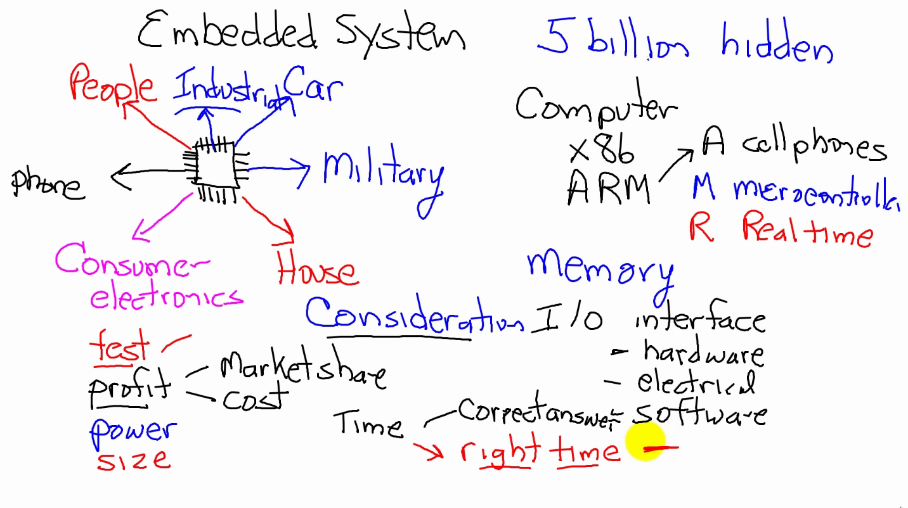
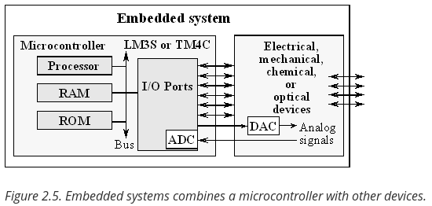
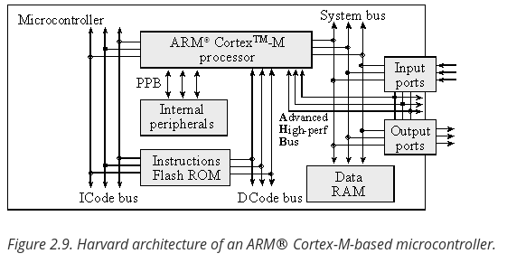
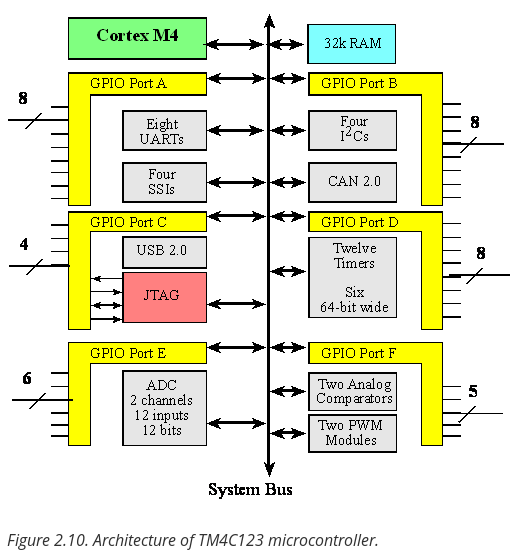
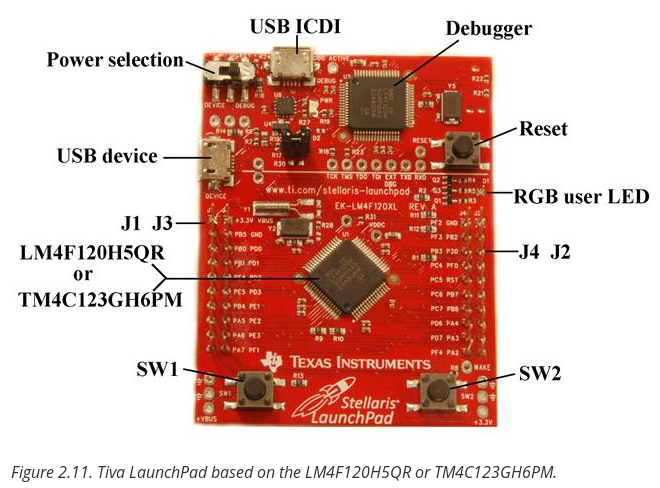
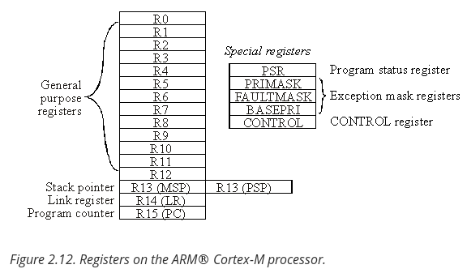

# Embedded System

 An embedded system is a microcomputer with mechanical, chemical, or electrical devices attached to it, programmed for a specific dedicated purpose, and packaged up as a complete system.

 

## Embedded Microcomputer System

* **Embedded** means hidden inside so one can’t see it. 
* **Micro** means small, and a **computer** contains a processor, memory, and a means to exchange data with the external world. 
* **System** means multiple components interfaced together for a common purpose.

**Microcontrollers**, which are microcomputers incorporating the processor, 
RAM, ROM and I/O ports into a single package, are often employed in an 
embedded system because of their low cost, small size, and low power requirements.



## Embedded System Properties

* A microcontroller hidden inside
* A dedicated purpose
* Runs in real time
* Input/output is important
* High volume, low cost
* Extremely reliable
* Low power
* Small size and weight

## Computer Organization

Software is a set of instructions, stored in memory, that are executed in a complicated but well-defined manner
processor executes the software by retrieving and interpreting these instructions one at a time.
microprocessor is a small processor, where small refers to size (i.e., it fits in your hand) and not computational ability

## ARM®Cortex™-M processor

It is a **Harvard architecture** because it has separate data and instruction buses. The Cortex-M instruction set combines the high performance typical of a
32-bit processor with high code density typical of 8-bit and 16-bit
microcontrollers.

* Instructions are **fetched** from flash **ROM** using the **ICode bus**.
* Data are exchanged with memory and **I/O** via the **system bus interface**.
* On the Cortex-M4 there is a **second I/O bus** for high-speed devices like USB.
* There are many sophisticated **debugging features** utilizing the **DCode bus**.
* Some internal peripherals, like the **NVIC** communicate directly with the
processor via the **private peripheral bus (PPB)**.




## I/O Ports

* An **input port** is hardware on the microcontroller that allows information about the external 
world to be entered into the computer.
* **output port** to send information out to the external world.
* An **interface*** is defined as the collection of the I/O port, external electronics, 
physical devices, and the software, which combine to allow the computer to communicate 
with the external world.

In general, we can classify I/O interfaces into four categories:

* **Parallel** - binary data are available simultaneously on a group of lines
* **Serial** - binary data are available one bit at a time on a single line
* **Analog** - data are encoded as an electrical voltage, current, or power
* **Time** - data are encoded as a period, frequency, pulse width, or phase shift

Ports on the TM4C123:



LaunchpPad Evoluation Kit for TM4C123:



Registers on the ARM Cortex M4




## Questions and Answer

1. What is an embedded system?

* An embedded system is a microcomputer with mechanical, chemical, or electrical 
devices attached to it, programmed for a specific dedicated purpose, and packaged up as a complete system.

2. What is a microcomputer?

* A microcomputer is a small computer that includes a processor, memory and I/O devices.

3. An input device allows information to be entered into the computer. 
List some of the input devices available on a general purpose computer.

* Typical input devices include the keys on the keyboard, mouse and its buttons, 
touch pad, DVD reader, and microphone. USB drives, Ethernet, and wireless can be used for input and output.

4. An output device allows information to exit the computer. 
List some of the output devices available on a general purpose computer.

* Typical output devices include the LEDs on the keyboard, monitor, printer, 
DVD burner, and speaker. USB drives, Ethernet, and wireless can be used for input and output.

5. What are the differences between a microcomputer, a microprocessor, and a microcontroller?

* A microprocessor is a small processor. A microcomputer is a small computer that 
includes a processor, memory and I/O devices. A microcontroller is a single chip computer.

6. Which has a higher information density on the chip in bits per mm2: static RAM or flash ROM? 
Assume all MOSFETs are approximately the same size in mm2.

* Flash ROM is higher density because it requires few transistors compared to RAM.

7. What is the addressing mode used for?

The addressing mode defines the format for the effective address for that instruction. In other words, it defines how the instruction will access the data it needs.

8. Assume R3 equals 0x2000.0000 at the time LDR R2,[R3,#8] is executed. What address will be accessed? If R3 is changed, to what value will R3 become?

0x2000.0008, R3 is not changed.

9. Assume R3 equals 0x2000.0000 at the time LDR R2,[R3],#8 is executed. What address will be accessed? If R3 is changed, to what value will R3 become?

0x2000.0000, and 8 is added to R3, it becomes 0x2000.0008.


### Lab 2

Useful links:

https://www.keil.com/demo/eval/armv4.htm


## C3 Eletronics

V = I x R

Power = Voltage * Current

Energy = Power * Time


P = V * I
Power = Voltage  * Current

P = V2 / R
Power = Voltage2 / Resistance           

P = I2 * R
Power = Current2 * Resistance

The energy (E in joules) stored in a battery can be calculated from voltage (V in volts), current (I in amps), and time (t in seconds). In a manner similar to power, energy has neither a polarity nor a direction.

E = V * I * t 
Energy = Voltage  * Current  * time

E = P * t
Energy = Power  * time


## C6 Microcontroller Ports

I/O pins on Tiva TM4C  microcontrollers have a wide range of alternative functions:

* UART - Universal asynchronous receiver/transmitter
    * Can be used for serial communication between computers.
    * It is asynchronous and allows for simultaneous communication in both directions.
* SSI - Synchronous serial interface
    * It is alternately called serial peripheral interface (**SPI**). 
    * It is used to interface medium-speed I/O devices. 
    * In this book, we will use it to interface a graphics display. 
    * We could use SSI to interface a digital to analog converter (**DAC**) or a secure digital card (**SDC**).
* I2C - Inter-integrated circuit
    * It is a simple I/O bus that we will use to interface low speed peripheral devices. 
    * Input capture and output compare will be used to create periodic interrupts and measure period, pulse width, phase, and frequency.
* Timer - Periodic interrupts, input capture, and output compare
* PWM - Pulse width modulation
    * Its outputs will be used to apply variable power to motor interfaces.
    * In a typical motor controller, input capture measures rotational speed, and PWM controls power.
    * A PWM output can also be used to create a **DAC**. 
* ADC - Analog to digital converter, measure analog signals
    * It will be used to measure the amplitude of analog signals and will be important in data acquisition systems.
* Analog Comparator - Compare two analog signals
    * The analog comparator takes two analog inputs and produces a digital output depending on which analog input is greater. 
* QEI - Quadrature encoder interface
    * It can be used to interface a brushless DC motor
* USB - Universal serial bus
    *  is a high-speed serial communication channel. 
* Ethernet - High-speed network
    * It is a port that can be used to bridge the microcontroller to the Internet or a local area network
* CAN - Controller area network
    * It creates a high-speed communication channel between microcontrollers and is commonly found in automotive and other distributed control applications.


```C
// Subroutine to initialize port F pins for input and output
// PF4 is input SW1 and PF2 is output Blue LED
// Inputs: None
// Outputs: None
// Notes: ...

void PortF_Init(void){ 
    
    volatile unsigned long delay;

  SYSCTL_RCGC2_R |= 0x00000020;     // 1) activate clock for Port F 
  //Each device has a separate clock that can be turned on.
 //And so we're going to set bit 5 in this clock register to enable the
 //clock for port F. It takes 3 to 5 cycles for the clock to stabilize.
  delay = SYSCTL_RCGC2_R;           // allow time for clock to star
  GPIO_PORTF_LOCK_R = 0x4C4F434B;   // 2) unlock GPIO Port F
  GPIO_PORTF_CR_R = 0x1F;           // allow changes to PF4-0
  // only PF0 needs to be unlocked, other bits can't be locked
  GPIO_PORTF_AMSEL_R = 0x00;        // 3) disable analog on PF
  GPIO_PORTF_PCTL_R = 0x00000000;   // 4) PCTL GPIO on PF4-0
  GPIO_PORTF_DIR_R = 0x0E;          // 5) PF4,PF0 in, PF3-1 out
  GPIO_PORTF_AFSEL_R = 0x00;        // 6) disable alt funct on PF7-0
  GPIO_PORTF_PUR_R = 0x11;          // enable pull-up on PF0 and PF4
  GPIO_PORTF_DEN_R = 0x1F;          // 7) enable digital I/O on PF4-0
} 
```


https://www.embedded.com/device-registers-in-c/
https://microcontrollerslab.com/use-gpio-pins-tm4c123g-tiva-launchpad/

http://users.ece.utexas.edu/~valvano/Volume1/E-Book/C6_MicrocontrollerPorts.htm

main     Turn on the clock for Port F
               Clear the PF4 and PF2 bits in Port F AMSEL to disable analog
               Clear the PF4 and PF2 bit fields in Port F PCTL to configure as GPIO
               Set the Port F direction register so
                                PF4 is an input and
                                PF2 is an output
               Clear the PF4 and PF2 bits in Port F AFSEL to disable alternate functions
               Set the PF4 and PF2 bits in Port F DEN to enable digital
               Set the PF4 bit in Port F PUR to activate an internal pullup resistor
               Set the PF2 bit in Port F DATA so the LED is initially ON
loop       Delay about 100 ms
                Read the switch and test if the switch is pressed
                If PF4=0 (the switch is pressed),
                                toggle PF2 (flip bit from 0 to 1, or from 1 to 0)
                If PF4=1 (the switch is not pressed),
                                set PF2, so LED is ON
                Go to loop

https://reference.digilentinc.com/reference/instrumentation/digital-discovery/specifications